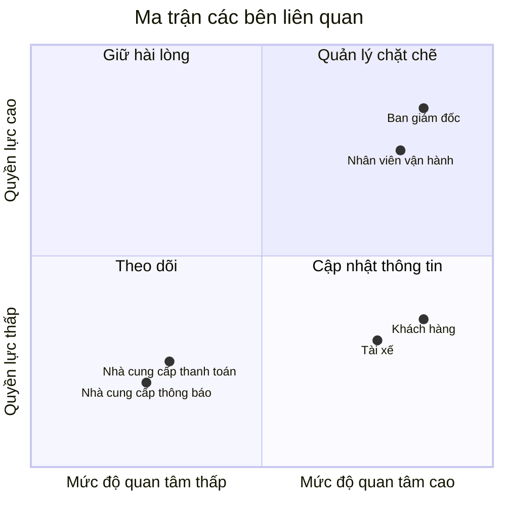
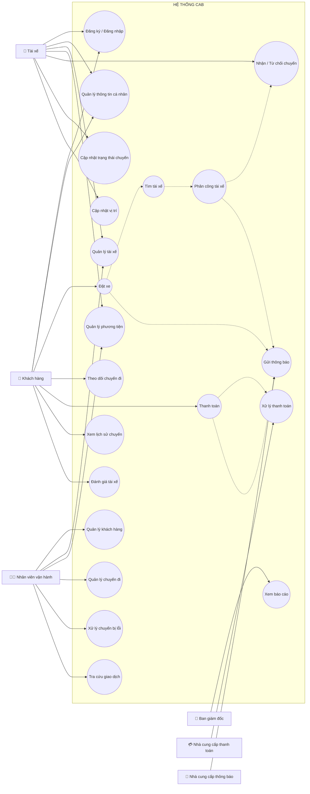

# 23641681_CaoXuanNguyen_cabsystem
---
# CÂU 1: TÌM HIỂU NGHIỆP VỤ

## a) Hệ thống hiện tại có những vấn đề gì?

Hệ thống hiện tại của Công ty ABC cho phép khách hàng liên hệ tổng đài hoặc sử dụng một ứng dụng đơn giản để yêu cầu xe. Tuy nhiên, hệ thống còn tồn tại một số hạn chế:

* Việc phân công tài xế chủ yếu được thực hiện thủ công nên mất nhiều thời gian.
* Khách hàng khó theo dõi trạng thái chuyến đi.
* Thông tin thanh toán chưa được quản lý tập trung.
* Bộ phận vận hành gặp khó khăn khi số lượng khách hàng và tài xế tăng.
* Khi tài xế đầu tiên từ chối hoặc không phản hồi, việc tìm tài xế khác chưa được tự động hóa tốt.
* Khó theo dõi vị trí tài xế để tìm tài xế gần khách hàng.
* Khó dự kiến thời gian tài xế đến điểm đón.
* Hệ thống hiện tại khó mở rộng thêm chức năng mới trong tương lai.
* Khi nhu cầu sử dụng tăng cao, hệ thống có nguy cơ gặp vấn đề về khả năng đáp ứng.

Các hạn chế trên là cơ sở để doanh nghiệp xây dựng một nền tảng CAB mới có khả năng phục vụ số lượng lớn khách hàng và tài xế, đồng thời có khả năng mở rộng trong tương lai.

---

## b) Mục tiêu chính của hệ thống

Hệ thống CAB mới hướng đến các mục tiêu:

* Cho phép khách hàng đăng ký và quản lý tài khoản.
* Cho phép khách hàng đặt xe trực tuyến.
* Tự động tìm kiếm và phân công tài xế phù hợp.
* Ưu tiên tài xế phù hợp và gần khách hàng.
* Cho phép khách hàng theo dõi trạng thái chuyến đi.
* Cho phép khách hàng xem thông tin tài xế và thời gian dự kiến tài xế đến.
* Cho phép tài xế nhận hoặc từ chối chuyến.
* Cho phép tài xế cập nhật trạng thái chuyến.
* Hỗ trợ lưu vị trí của tài xế.
* Hỗ trợ tính cước.
* Hỗ trợ thanh toán tiền mặt và thanh toán điện tử.
* Quản lý tập trung thông tin khách hàng, tài xế, phương tiện và chuyến đi.
* Gửi thông báo cho khách hàng và tài xế.
* Hỗ trợ nhân viên vận hành theo dõi và xử lý các chuyến đi.
* Cung cấp báo cáo về hoạt động của hệ thống.
* Đảm bảo hệ thống có khả năng mở rộng trong tương lai.

---

## c) Vấn đề hiện tại là gì?

Có thể tổng hợp các vấn đề chính thành:

1. **Phân công tài xế chưa hiệu quả:** việc tìm tài xế còn phụ thuộc nhiều vào thao tác thủ công.
2. **Khó theo dõi chuyến đi:** khách hàng chưa có đầy đủ thông tin về trạng thái và vị trí tài xế.
3. **Quản lý thanh toán chưa tập trung:** thông tin giao dịch chưa được quản lý thống nhất.
4. **Khó kiểm soát khi số lượng chuyến tăng:** nhân viên vận hành gặp khó khăn trong việc theo dõi và xử lý chuyến.
5. **Khả năng mở rộng hạn chế:** việc bổ sung dịch vụ, phương thức thanh toán hoặc kênh thông báo mới có thể ảnh hưởng đến hệ thống hiện tại.
6. **Chưa xác định đầy đủ một số quy tắc nghiệp vụ:** công thức tính cước, tiêu chí ưu tiên tài xế, thời gian phản hồi và chính sách hủy chuyến vẫn cần được làm rõ.

---

## d) Ai là người tham gia và sử dụng hệ thống?

### 1. Khách hàng (Customer)

Khách hàng sử dụng hệ thống để:

* Đăng ký tài khoản.
* Đăng nhập.
* Cập nhật thông tin cá nhân.
* Nhập điểm đón.
* Nhập điểm đến.
* Chọn loại xe.
* Đặt xe.
* Theo dõi trạng thái chuyến.
* Xem thông tin tài xế.
* Xem thời gian dự kiến tài xế đến.
* Xem lịch sử chuyến đi.
* Xem số tiền cần thanh toán.
* Thanh toán.
* Đánh giá tài xế sau chuyến đi.

### 2. Tài xế (Driver)

Tài xế có thể:

* Đăng ký tài khoản hoặc được nhân viên vận hành tạo tài khoản.
* Cập nhật thông tin cá nhân.
* Cập nhật thông tin phương tiện.
* Chuyển sang trạng thái sẵn sàng nhận chuyến.
* Nhận thông báo khi có chuyến mới.
* Chấp nhận hoặc từ chối chuyến.
* Cập nhật trạng thái chuyến.
* Cập nhật vị trí hiện tại.
* Xem thông tin các chuyến được phân công.

Các trạng thái chuyến chính:

```text
Đang đến điểm đón
        ↓
Đã đến điểm đón
        ↓
Đã đón khách
        ↓
Đang di chuyển
        ↓
Hoàn thành
```

### 3. Nhân viên vận hành (Operation Staff)

Nhân viên vận hành:

* Quản lý khách hàng.
* Quản lý tài xế.
* Quản lý phương tiện.
* Quản lý chuyến đi.
* Theo dõi các chuyến đang diễn ra.
* Kiểm tra trạng thái tài xế.
* Kiểm tra trạng thái chuyến.
* Xử lý các chuyến gặp lỗi.
* Tra cứu lịch sử giao dịch.
* Theo dõi hoạt động của hệ thống.

### 4. Ban giám đốc (Management)

Ban giám đốc:

* Theo dõi số lượng chuyến.
* Theo dõi doanh thu.
* Theo dõi tỷ lệ chuyến hoàn thành.
* Theo dõi tỷ lệ chuyến hủy.
* Theo dõi hiệu quả hoạt động của tài xế.
* Đưa ra định hướng phát triển hệ thống.

### 5. Nhà cung cấp thanh toán (Payment Provider)

* Xử lý các giao dịch thanh toán điện tử.
* Trả kết quả giao dịch về hệ thống CAB.
* Thông báo kết quả thành công hoặc thất bại.
* Hệ thống CAB không lưu trực tiếp thông tin nhạy cảm của thẻ hoặc tài khoản thanh toán.

### 6. Nhà cung cấp dịch vụ thông báo (Notification Provider)

* Gửi thông báo đặt xe.
* Gửi thông báo khi tài xế nhận chuyến.
* Gửi thông báo khi tài xế đến điểm đón.
* Gửi thông báo khi chuyến hoàn thành.
* Gửi thông báo kết quả thanh toán.
* Gửi thông báo khi chuyến có thay đổi.

---

# CÂU 2: CÁC BÊN LIÊN QUAN

| STT | Bên liên quan               | Vai trò                                                                        |
| --- | --------------------------- | ------------------------------------------------------------------------------ |
| 1   | **Khách hàng**              | Đặt xe, theo dõi chuyến, thanh toán và đánh giá tài xế.                        |
| 2   | **Tài xế**                  | Nhận chuyến, cập nhật trạng thái và vị trí.                                    |
| 3   | **Nhân viên vận hành**      | Quản lý khách hàng, tài xế, phương tiện và chuyến đi.                          |
| 4   | **Ban giám đốc**            | Theo dõi báo cáo và định hướng phát triển hệ thống.                            |
| 5   | **Nhà cung cấp thanh toán** | Xử lý thanh toán điện tử.                                                      |
| 6   | **Nhà cung cấp thông báo**  | Cung cấp dịch vụ gửi thông báo.                                                |
| 7   | **Business Analyst**        | Phân tích nghiệp vụ, xác định yêu cầu và làm rõ các vấn đề chưa được xác định. |
| 8   | **Nhóm phát triển**         | Xây dựng, kiểm thử và triển khai hệ thống.                                     |

Các stakeholder chính được xác định dựa trên vai trò của họ trong hệ thống CAB.

---

# CÂU 3: MA TRẬN CÁC BÊN LIÊN QUAN

## 3.1. Bảng phân loại stakeholder

| Bên liên quan               | Quyền lực | Mức độ quan tâm | Chiến lược         |
| --------------------------- | --------- | --------------- | ------------------ |
| **Ban giám đốc**            | Cao       | Cao             | Quản lý chặt chẽ   |
| **Nhân viên vận hành**      | Cao       | Cao             | Quản lý chặt chẽ   |
| **Khách hàng**              | Thấp      | Cao             | Cập nhật thông tin |
| **Tài xế**                  | Thấp      | Cao             | Cập nhật thông tin |
| **Nhà cung cấp thanh toán** | Thấp      | Thấp            | Theo dõi           |
| **Nhà cung cấp thông báo**  | Thấp      | Thấp            | Theo dõi           |

---

## 3.2. Ma trận Quyền lực – Mức độ quan tâm



### Phân tích

* **Ban giám đốc:** quyền lực và mức độ quan tâm cao nên cần được quản lý chặt chẽ.
* **Nhân viên vận hành:** trực tiếp sử dụng hệ thống hằng ngày nên có quyền lực và mức độ quan tâm cao.
* **Khách hàng:** mức độ quan tâm cao vì trực tiếp sử dụng dịch vụ nhưng quyền lực đối với dự án thấp hơn ban giám đốc.
* **Tài xế:** có mức độ quan tâm cao vì hệ thống ảnh hưởng trực tiếp đến hoạt động nhận chuyến.
* **Nhà cung cấp thanh toán và thông báo:** là các bên tích hợp bên ngoài nên chủ yếu cần được theo dõi và phối hợp khi cần.

---

# CÂU 4: PHẠM VI DỰ ÁN TRONG 7 TUẦN

## 4.1. Phạm vi trong dự án

Trong 7 tuần, dự án tập trung xây dựng các chức năng cốt lõi để CAB có thể thực hiện quy trình:

```text
Đặt xe
   ↓
Tìm tài xế
   ↓
Phân công tài xế
   ↓
Thực hiện chuyến
   ↓
Hoàn thành
   ↓
Tính cước
   ↓
Thanh toán
   ↓
Đánh giá
```

---

## 4.2. Các module trong phạm vi

| STT | Module                 | Chức năng chính                                         |
| --- | ---------------------- | ------------------------------------------------------- |
| 1   | Xác thực và phân quyền | Đăng ký, đăng nhập, đăng xuất và phân quyền.            |
| 2   | Quản lý khách hàng     | Quản lý thông tin và lịch sử khách hàng.                |
| 3   | Quản lý tài xế         | Quản lý hồ sơ và trạng thái tài xế.                     |
| 4   | Quản lý phương tiện    | Quản lý loại xe và phương tiện.                         |
| 5   | Đặt xe                 | Nhập điểm đón, điểm đến và loại xe.                     |
| 6   | Tìm tài xế             | Tìm tài xế phù hợp và gần khách hàng.                   |
| 7   | Phân công tài xế       | Gửi yêu cầu và xử lý trường hợp từ chối/không phản hồi. |
| 8   | Quản lý chuyến đi      | Theo dõi toàn bộ trạng thái chuyến.                     |
| 9   | Định vị tài xế         | Theo dõi vị trí và hỗ trợ dự kiến thời gian đến.        |
| 10  | Tính cước              | Tính số tiền khách hàng cần trả.                        |
| 11  | Thanh toán             | Tiền mặt và thanh toán điện tử.                         |
| 12  | Thông báo              | Gửi thông báo đến khách hàng và tài xế.                 |
| 13  | Đánh giá               | Đánh giá tài xế sau chuyến.                             |
| 14  | Vận hành               | Theo dõi và xử lý chuyến.                               |
| 15  | Báo cáo                | Thống kê chuyến, doanh thu và hiệu quả tài xế.          |

---

## 4.3. Kế hoạch thực hiện trong 7 tuần

| Tuần       | Nội dung                                                                        |
| ---------- | ------------------------------------------------------------------------------- |
| **Tuần 1** | Khảo sát nghiệp vụ, xác định stakeholder, phạm vi và yêu cầu.                   |
| **Tuần 2** | Phân tích yêu cầu, phân rã chức năng, thiết kế Use Case và quy trình nghiệp vụ. |
| **Tuần 3** | Thiết kế cơ sở dữ liệu, xác thực, phân quyền và quản lý người dùng.             |
| **Tuần 4** | Xây dựng chức năng đặt xe, tìm và phân công tài xế.                             |
| **Tuần 5** | Xây dựng quản lý chuyến, định vị, tính cước và thanh toán.                      |
| **Tuần 6** | Xây dựng thông báo, đánh giá, vận hành và báo cáo.                              |
| **Tuần 7** | Tích hợp, kiểm thử, sửa lỗi và hoàn thiện hệ thống.                             |

### Ngoài phạm vi 7 tuần

Các nội dung chưa được xác định chi tiết hoặc có thể triển khai ở giai đoạn sau:

* Các loại dịch vụ mới.
* Nhiều nhà cung cấp thanh toán.
* Nhiều nhà cung cấp thông báo.
* Các kênh thông báo mở rộng.
* Các chính sách nghiệp vụ chưa được khách hàng chốt.
* Các chức năng nâng cao chưa thuộc quy trình đặt xe cốt lõi.

---

# CÂU 5: CHUYỂN CÁC YÊU CẦU THÀNH YÊU CẦU NGHIỆP VỤ

## 5.1. Danh sách Business Requirement

| Mã       | Nhóm nghiệp vụ   | Yêu cầu nghiệp vụ                                                     |
| -------- | ---------------- | --------------------------------------------------------------------- |
| **BR01** | Người dùng       | Hệ thống cho phép người dùng đăng ký, đăng nhập và quản lý tài khoản. |
| **BR02** | Khách hàng       | Hệ thống quản lý thông tin và lịch sử sử dụng dịch vụ của khách hàng. |
| **BR03** | Tài xế           | Hệ thống quản lý thông tin và trạng thái tài xế.                      |
| **BR04** | Phương tiện      | Hệ thống quản lý thông tin phương tiện và loại xe.                    |
| **BR05** | Đặt xe           | Khách hàng có thể nhập điểm đón, điểm đến, chọn loại xe và đặt xe.    |
| **BR06** | Tìm tài xế       | Hệ thống tự động tìm tài xế phù hợp.                                  |
| **BR07** | Phân công        | Hệ thống gửi yêu cầu đến tài xế và tìm tài xế khác khi cần.           |
| **BR08** | Chuyến đi        | Hệ thống quản lý trạng thái chuyến từ lúc đặt đến khi hoàn thành/hủy. |
| **BR09** | Theo dõi         | Hệ thống cập nhật vị trí và thời gian dự kiến tài xế đến.             |
| **BR10** | Tính cước        | Hệ thống xác định số tiền khách hàng phải thanh toán.                 |
| **BR11** | Thanh toán       | Hỗ trợ tiền mặt và thanh toán điện tử.                                |
| **BR12** | Giao dịch        | Ghi nhận kết quả thanh toán thành công hoặc thất bại.                 |
| **BR13** | Thông báo        | Gửi thông báo đến khách hàng và tài xế.                               |
| **BR14** | Đánh giá         | Khách hàng có thể đánh giá tài xế sau chuyến.                         |
| **BR15** | Vận hành         | Nhân viên vận hành quản lý các dữ liệu và chuyến đi.                  |
| **BR16** | Sự cố            | Nhân viên vận hành có thể xử lý chuyến gặp sự cố.                     |
| **BR17** | Báo cáo          | Hệ thống cung cấp báo cáo hoạt động.                                  |
| **BR18** | Phân quyền       | Chức năng được giới hạn theo vai trò.                                 |
| **BR19** | Thanh toán ngoài | Hệ thống kết nối với nhà cung cấp thanh toán.                         |
| **BR20** | Thông báo ngoài  | Hệ thống kết nối với nhà cung cấp thông báo.                          |
| **BR21** | Mở rộng          | Hệ thống có khả năng bổ sung dịch vụ và nhà cung cấp mới.             |

---

## 5.2. Business Requirement theo stakeholder

| Stakeholder                 | Business Requirement                                           |
| --------------------------- | -------------------------------------------------------------- |
| **Khách hàng**              | Đăng ký, đặt xe, theo dõi chuyến, thanh toán và đánh giá.      |
| **Tài xế**                  | Quản lý thông tin, nhận/từ chối chuyến và cập nhật trạng thái. |
| **Nhân viên vận hành**      | Quản lý dữ liệu, theo dõi chuyến và xử lý sự cố.               |
| **Ban giám đốc**            | Theo dõi báo cáo và hiệu quả hoạt động.                        |
| **Nhà cung cấp thanh toán** | Xử lý giao dịch điện tử.                                       |
| **Nhà cung cấp thông báo**  | Gửi thông báo cho người dùng.                                  |

---

# CÂU 6: PHÂN RÃ CÁC YÊU CẦU CHỨC NĂNG

## FR01 – Quản lý người dùng

* Đăng ký tài khoản.
* Đăng nhập.
* Đăng xuất.
* Xác thực tài khoản.
* Cập nhật thông tin cá nhân.
* Quản lý thông tin tài khoản.
* Xác định vai trò.
* Kiểm tra quyền truy cập.

## FR02 – Quản lý khách hàng

* Tạo thông tin khách hàng.
* Cập nhật thông tin khách hàng.
* Xem thông tin khách hàng.
* Tìm kiếm khách hàng.
* Xem lịch sử chuyến đi.
* Xem lịch sử thanh toán.

## FR03 – Quản lý tài xế

* Tạo thông tin tài xế.
* Cập nhật thông tin tài xế.
* Xem thông tin tài xế.
* Cập nhật trạng thái hoạt động.
* Cập nhật trạng thái sẵn sàng.
* Cập nhật vị trí.
* Xem lịch sử chuyến.

## FR04 – Quản lý phương tiện

* Thêm phương tiện.
* Cập nhật phương tiện.
* Xem thông tin phương tiện.
* Xác định loại xe.
* Gán phương tiện cho tài xế.
* Thay đổi phương tiện.
* Kiểm tra trạng thái phương tiện.

## FR05 – Đặt xe

* Nhập điểm đón.
* Nhập điểm đến.
* Chọn loại xe.
* Tạo yêu cầu đặt xe.
* Kiểm tra thông tin.
* Xác nhận đặt xe.
* Hủy yêu cầu.
* Xem trạng thái yêu cầu.

## FR06 – Tìm tài xế

* Xác định điểm đón.
* Xác định tài xế sẵn sàng.
* Kiểm tra loại xe.
* Lấy vị trí tài xế.
* Tính khoảng cách.
* Xác định tài xế phù hợp.
* Ưu tiên tài xế gần khách hàng.
* Gửi yêu cầu nhận chuyến.
* Chờ phản hồi.
* Ghi nhận phản hồi.
* Tìm tài xế khác khi từ chối.
* Tìm tài xế khác khi không phản hồi.
* Thông báo khi không tìm được tài xế.

## FR07 – Phân công tài xế

* Gửi yêu cầu chuyến.
* Ghi nhận tài xế nhận chuyến.
* Ghi nhận tài xế từ chối.
* Kiểm tra thời gian phản hồi.
* Xử lý không phản hồi.
* Chuyển sang tài xế tiếp theo.
* Xác nhận tài xế được phân công.
* Thông báo tài xế cho khách hàng.

## FR08 – Quản lý chuyến đi

* Tạo chuyến.
* Gắn khách hàng.
* Gắn tài xế.
* Cập nhật trạng thái.
* Theo dõi trạng thái.
* Ghi nhận đã đến điểm đón.
* Ghi nhận đã đón khách.
* Ghi nhận đang di chuyển.
* Ghi nhận hoàn thành.
* Hủy chuyến.
* Lưu lịch sử.

## FR09 – Theo dõi vị trí tài xế

* Nhận vị trí tài xế.
* Cập nhật vị trí.
* Lưu vị trí.
* Hiển thị vị trí.
* Tính khoảng cách.
* Cập nhật thời gian dự kiến.
* Theo dõi vị trí trong chuyến.

## FR10 – Tính cước

* Xác định loại dịch vụ.
* Lấy thông tin chuyến.
* Xác định dữ liệu tính cước.
* Tính số tiền.
* Hiển thị số tiền.
* Lưu thông tin cước.
* Liên kết cước với chuyến.

## FR11 – Thanh toán

* Hiển thị số tiền.
* Chọn phương thức thanh toán.
* Thanh toán tiền mặt.
* Thanh toán điện tử.
* Tạo giao dịch.
* Gửi giao dịch đến nhà cung cấp.
* Nhận kết quả.
* Cập nhật trạng thái.

## FR12 – Xử lý thanh toán

* Ghi nhận thành công.
* Ghi nhận thất bại.
* Hiển thị kết quả.
* Gửi thông báo.
* Lưu lịch sử.
* Cho phép xử lý lại khi thất bại.
* Không lưu trực tiếp dữ liệu nhạy cảm thanh toán.

## FR13 – Thông báo

* Xác định sự kiện.
* Thông báo tiếp nhận yêu cầu.
* Thông báo tài xế nhận chuyến.
* Thông báo tài xế đến.
* Thông báo hoàn thành chuyến.
* Thông báo kết quả thanh toán.
* Thông báo chuyến mới cho tài xế.
* Thông báo khi chuyến thay đổi.
* Ghi nhận trạng thái gửi.

## FR14 – Đánh giá tài xế

* Đánh giá sau chuyến.
* Nhập mức đánh giá.
* Lưu đánh giá.
* Liên kết với chuyến.
* Liên kết với tài xế.
* Xem kết quả đánh giá.

## FR15 – Quản lý vận hành

* Xem khách hàng.
* Xem tài xế.
* Xem phương tiện.
* Xem chuyến.
* Xem chuyến đang diễn ra.
* Kiểm tra trạng thái tài xế.
* Kiểm tra trạng thái chuyến.
* Tra cứu giao dịch.
* Hỗ trợ chuyến gặp lỗi.

## FR16 – Xử lý sự cố

* Xác định chuyến gặp sự cố.
* Xem thông tin chuyến.
* Kiểm tra trạng thái.
* Cập nhật trạng thái xử lý.
* Hỗ trợ xử lý.
* Lưu lịch sử xử lý.

## FR17 – Báo cáo

* Thống kê số chuyến.
* Thống kê doanh thu.
* Tính tỷ lệ hoàn thành.
* Tính tỷ lệ hủy.
* Thống kê hiệu quả tài xế.
* Lọc dữ liệu.
* Xem báo cáo.

## FR18 – Phân quyền

* Xác định vai trò.
* Cấp quyền.
* Kiểm tra quyền.
* Giới hạn chức năng.
* Kiểm soát thao tác quản trị.
* Ghi nhận thao tác quan trọng.

## FR19 – Tích hợp thanh toán

* Kết nối nhà cung cấp.
* Gửi yêu cầu thanh toán.
* Nhận kết quả.
* Xử lý thành công.
* Xử lý thất bại.
* Xử lý lỗi kết nối.
* Bảo vệ thông tin thanh toán.

## FR20 – Tích hợp thông báo

* Kết nối nhà cung cấp.
* Gửi yêu cầu thông báo.
* Nhận trạng thái gửi.
* Xử lý lỗi gửi.
* Hỗ trợ thêm kênh mới.

## FR21 – Khả năng mở rộng

* Thêm loại dịch vụ.
* Thêm phương thức thanh toán.
* Thêm nhà cung cấp thanh toán.
* Thêm nhà cung cấp thông báo.
* Triển khai chức năng mới từng phần.
* Hạn chế ảnh hưởng đến chức năng đang hoạt động.

---

# CÂU 7: VẼ USE CASE DIAGRAM

## 7.1. Các tác nhân

```text
Khách hàng
Tài xế
Nhân viên vận hành
Ban giám đốc
Nhà cung cấp thanh toán
Nhà cung cấp thông báo
```

## 7.2. Use Case Diagram



---

# CÂU 8: ĐẶC TẢ USE CASE

---

## UC01 – Đăng nhập

**Mã Use Case:** UC01  
**Tên Use Case:** Đăng nhập  
**Tác nhân:** Khách hàng, Tài xế, Nhân viên vận hành, Ban giám đốc  
**Mục đích:** Cho phép người dùng đăng nhập vào hệ thống.  
**Điều kiện trước:** Người dùng đã có tài khoản.  
**Điều kiện sau:** Người dùng đăng nhập thành công và được truy cập các chức năng theo quyền.

### 1. Luồng chính

1. Người dùng chọn chức năng **Đăng nhập**.
2. Hệ thống hiển thị màn hình đăng nhập.
3. Người dùng nhập tên đăng nhập và mật khẩu.
4. Người dùng chọn **Đăng nhập**.
5. Hệ thống kiểm tra thông tin đăng nhập.
6. Hệ thống xác thực tài khoản.
7. Hệ thống xác định vai trò của người dùng.
8. Hệ thống kiểm tra quyền truy cập.
9. Hệ thống cho phép người dùng đăng nhập.
10. Hệ thống hiển thị giao diện phù hợp với vai trò.

### 2. Luồng phụ

**2a. Người dùng chọn ghi nhớ đăng nhập**

1. Người dùng chọn chức năng ghi nhớ đăng nhập.
2. Hệ thống ghi nhận lựa chọn.
3. Tiếp tục bước 3 của luồng chính.

**7a. Tài khoản có nhiều quyền**

1. Hệ thống xác định các quyền của tài khoản.
2. Hệ thống hiển thị các chức năng tương ứng.
3. Tiếp tục bước 8 của luồng chính.

### 3. Luồng ngoại lệ

**5a. Sai tên đăng nhập hoặc mật khẩu**

1. Hệ thống thông báo thông tin đăng nhập không chính xác.
2. Người dùng nhập lại thông tin.
3. Quay lại bước 3 của luồng chính.

**5b. Tài khoản không hoạt động**

1. Hệ thống phát hiện tài khoản không hoạt động.
2. Hệ thống thông báo cho người dùng.
3. Use Case kết thúc.

---

# UC02 – Đặt xe

**Mã Use Case:** UC02  
**Tên Use Case:** Đặt xe  
**Tác nhân:** Khách hàng  
**Mục đích:** Cho phép khách hàng tạo yêu cầu đặt xe.  
**Điều kiện trước:** Khách hàng đã đăng nhập.  
**Điều kiện sau:** Yêu cầu đặt xe được tạo thành công.

### 1. Luồng chính

1. Khách hàng chọn chức năng **Đặt xe**.
2. Hệ thống hiển thị màn hình đặt xe.
3. Khách hàng nhập điểm đón.
4. Khách hàng nhập điểm đến.
5. Khách hàng chọn loại xe.
6. Khách hàng kiểm tra thông tin chuyến.
7. Khách hàng xác nhận đặt xe.
8. Hệ thống kiểm tra thông tin.
9. Hệ thống tạo yêu cầu đặt xe.
10. Hệ thống chuyển yêu cầu sang chức năng tìm tài xế.
11. Hệ thống thông báo yêu cầu đặt xe đã được tiếp nhận.

### 2. Luồng phụ

**3a. Khách hàng chọn điểm đón trên bản đồ**

1. Khách hàng chọn vị trí trên bản đồ.
2. Hệ thống xác định điểm đón.
3. Hệ thống hiển thị điểm đón.
4. Tiếp tục bước 4 của luồng chính.

**4a. Khách hàng chọn điểm đến trên bản đồ**

1. Khách hàng chọn vị trí trên bản đồ.
2. Hệ thống xác định điểm đến.
3. Hệ thống hiển thị điểm đến.
4. Tiếp tục bước 5 của luồng chính.

**7a. Khách hàng thay đổi thông tin chuyến**

1. Khách hàng chỉnh sửa thông tin.
2. Hệ thống cập nhật thông tin.
3. Quay lại bước 6 của luồng chính.

### 3. Luồng ngoại lệ

**8a. Thiếu điểm đón**

1. Hệ thống phát hiện chưa có điểm đón.
2. Hệ thống thông báo yêu cầu nhập điểm đón.
3. Khách hàng bổ sung điểm đón.
4. Quay lại bước 6 của luồng chính.

**8b. Thiếu điểm đến**

1. Hệ thống phát hiện chưa có điểm đến.
2. Hệ thống thông báo yêu cầu nhập điểm đến.
3. Khách hàng bổ sung điểm đến.
4. Quay lại bước 6 của luồng chính.

**8c. Loại xe không hợp lệ**

1. Hệ thống phát hiện loại xe không hợp lệ.
2. Hệ thống yêu cầu khách hàng chọn lại loại xe.
3. Quay lại bước 5 của luồng chính.

---

# UC03 – Tìm và phân công tài xế

**Mã Use Case:** UC03  
**Tên Use Case:** Tìm và phân công tài xế  
**Tác nhân:** Hệ thống, Tài xế  
**Mục đích:** Tìm tài xế phù hợp và phân công tài xế cho chuyến đi.  
**Điều kiện trước:** Hệ thống đã nhận yêu cầu đặt xe.  
**Điều kiện sau:** Tài xế được phân công cho chuyến hoặc không tìm được tài xế.

### 1. Luồng chính

1. Hệ thống nhận yêu cầu đặt xe.
2. Hệ thống xác định điểm đón.
3. Hệ thống xác định loại xe.
4. Hệ thống tìm các tài xế đang sẵn sàng.
5. Hệ thống kiểm tra loại xe của tài xế.
6. Hệ thống xác định các tài xế phù hợp.
7. Hệ thống ưu tiên tài xế phù hợp và gần khách hàng.
8. Hệ thống gửi yêu cầu nhận chuyến cho tài xế.
9. Tài xế chấp nhận chuyến.
10. Hệ thống xác nhận tài xế được phân công.
11. Hệ thống cập nhật thông tin chuyến.
12. Hệ thống thông báo thông tin tài xế cho khách hàng.

### 2. Luồng phụ

**7a. Có nhiều tài xế phù hợp**

1. Hệ thống xác định danh sách tài xế phù hợp.
2. Hệ thống sắp xếp tài xế theo tiêu chí ưu tiên.
3. Hệ thống chọn tài xế phù hợp.
4. Tiếp tục bước 8 của luồng chính.

**9a. Tài xế chấp nhận chuyến**

1. Hệ thống ghi nhận phản hồi của tài xế.
2. Hệ thống xác nhận tài xế nhận chuyến.
3. Tiếp tục bước 10 của luồng chính.

### 3. Luồng ngoại lệ

**4a. Không có tài xế phù hợp**

1. Hệ thống không tìm thấy tài xế phù hợp.
2. Hệ thống thông báo cho khách hàng.
3. Use Case kết thúc.

**9b. Tài xế từ chối chuyến**

1. Hệ thống ghi nhận tài xế từ chối.
2. Hệ thống loại tài xế khỏi yêu cầu hiện tại.
3. Hệ thống tìm tài xế khác.
4. Quay lại bước 7 của luồng chính.

**9c. Tài xế không phản hồi**

1. Hệ thống phát hiện tài xế không phản hồi.
2. Hệ thống ghi nhận trạng thái không phản hồi.
3. Hệ thống tìm tài xế khác.
4. Quay lại bước 7 của luồng chính.

---

# UC04 – Thực hiện chuyến đi

**Mã Use Case:** UC04  
**Tên Use Case:** Thực hiện chuyến đi  
**Tác nhân:** Tài xế  
**Mục đích:** Cho phép tài xế thực hiện chuyến và cập nhật trạng thái chuyến.  
**Điều kiện trước:** Tài xế đã được phân công chuyến.  
**Điều kiện sau:** Chuyến hoàn thành hoặc bị hủy.

### 1. Luồng chính

1. Tài xế nhận thông tin chuyến.
2. Tài xế bắt đầu di chuyển đến điểm đón.
3. Hệ thống cập nhật trạng thái **Đang đến điểm đón**.
4. Tài xế đến điểm đón.
5. Tài xế cập nhật trạng thái **Đã đến điểm đón**.
6. Tài xế đón khách.
7. Tài xế cập nhật trạng thái **Đã đón khách**.
8. Tài xế bắt đầu di chuyển đến điểm đến.
9. Hệ thống cập nhật trạng thái **Đang di chuyển**.
10. Tài xế đến điểm đến.
11. Tài xế cập nhật trạng thái **Hoàn thành**.
12. Hệ thống ghi nhận chuyến đã hoàn thành.

### 2. Luồng phụ

**3a. Tài xế cập nhật vị trí**

1. Hệ thống nhận vị trí hiện tại của tài xế.
2. Hệ thống cập nhật vị trí.
3. Hệ thống hiển thị vị trí cho khách hàng.
4. Tiếp tục thực hiện chuyến.

**9a. Tài xế cập nhật vị trí trong quá trình di chuyển**

1. Tài xế gửi vị trí hiện tại.
2. Hệ thống cập nhật vị trí.
3. Hệ thống cập nhật thông tin thời gian dự kiến.
4. Tiếp tục bước 10 của luồng chính.

### 3. Luồng ngoại lệ

**4a. Tài xế không thể đến điểm đón**

1. Tài xế thông báo không thể tiếp tục chuyến.
2. Hệ thống ghi nhận tình trạng chuyến.
3. Nhân viên vận hành tiếp nhận xử lý.
4. Use Case kết thúc.

**6a. Không thể đón khách**

1. Tài xế thông báo tình trạng.
2. Hệ thống cập nhật thông tin chuyến.
3. Nhân viên vận hành tiếp nhận xử lý.
4. Use Case kết thúc.

**11a. Chuyến bị hủy**

1. Hệ thống nhận thông tin hủy chuyến.
2. Hệ thống cập nhật trạng thái **Đã hủy**.
3. Hệ thống gửi thông báo cho các bên liên quan.
4. Use Case kết thúc.

---

# UC05 – Theo dõi chuyến đi

**Mã Use Case:** UC05  
**Tên Use Case:** Theo dõi chuyến đi  
**Tác nhân:** Khách hàng  
**Mục đích:** Cho phép khách hàng theo dõi trạng thái và vị trí tài xế.  
**Điều kiện trước:** Khách hàng có chuyến đang thực hiện.  
**Điều kiện sau:** Khách hàng xem được thông tin chuyến.

### 1. Luồng chính

1. Khách hàng mở thông tin chuyến.
2. Hệ thống hiển thị trạng thái chuyến.
3. Hệ thống hiển thị thông tin tài xế.
4. Hệ thống hiển thị vị trí tài xế.
5. Hệ thống cập nhật vị trí tài xế.
6. Hệ thống cập nhật thời gian dự kiến.
7. Khách hàng theo dõi thông tin chuyến.

### 2. Luồng phụ

**5a. Vị trí tài xế thay đổi**

1. Hệ thống nhận vị trí mới của tài xế.
2. Hệ thống cập nhật vị trí.
3. Hệ thống cập nhật thời gian dự kiến.
4. Tiếp tục bước 7 của luồng chính.

**2a. Chuyến thay đổi trạng thái**

1. Hệ thống nhận trạng thái mới.
2. Hệ thống cập nhật trạng thái chuyến.
3. Hệ thống hiển thị trạng thái mới cho khách hàng.
4. Tiếp tục bước 3 của luồng chính.

### 3. Luồng ngoại lệ

**5b. Không nhận được vị trí tài xế**

1. Hệ thống phát hiện không nhận được dữ liệu vị trí.
2. Hệ thống thông báo vị trí chưa được cập nhật.
3. Hệ thống tiếp tục chờ dữ liệu mới.

**2b. Chuyến đã bị hủy**

1. Hệ thống nhận trạng thái chuyến bị hủy.
2. Hệ thống cập nhật trạng thái **Đã hủy**.
3. Hệ thống thông báo cho khách hàng.
4. Use Case kết thúc.

---

# UC06 – Thanh toán

**Mã Use Case:** UC06  
**Tên Use Case:** Thanh toán  
**Tác nhân:** Khách hàng  
**Mục đích:** Cho phép khách hàng thanh toán chi phí chuyến đi.  
**Điều kiện trước:** Chuyến đã hoàn thành và hệ thống đã xác định số tiền cần thanh toán.  
**Điều kiện sau:** Thanh toán được ghi nhận thành công hoặc thất bại.

### 1. Luồng chính

1. Hệ thống xác định số tiền cần thanh toán.
2. Hệ thống hiển thị số tiền cho khách hàng.
3. Khách hàng chọn phương thức thanh toán.
4. Hệ thống kiểm tra phương thức thanh toán.
5. Khách hàng xác nhận thanh toán.
6. Hệ thống xử lý giao dịch.
7. Hệ thống nhận kết quả thanh toán.
8. Hệ thống cập nhật trạng thái thanh toán.
9. Hệ thống thông báo kết quả cho khách hàng.

### 2. Luồng phụ

**3a. Khách hàng chọn thanh toán tiền mặt**

1. Khách hàng chọn phương thức tiền mặt.
2. Hệ thống ghi nhận phương thức thanh toán.
3. Hệ thống cập nhật thông tin thanh toán.
4. Tiếp tục bước 9 của luồng chính.

**3b. Khách hàng chọn thanh toán điện tử**

1. Khách hàng chọn phương thức thanh toán điện tử.
2. Hệ thống chuyển yêu cầu thanh toán.
3. Khách hàng thực hiện thanh toán.
4. Hệ thống nhận kết quả.
5. Tiếp tục bước 8 của luồng chính.

### 3. Luồng ngoại lệ

**7a. Thanh toán thất bại**

1. Hệ thống nhận kết quả thanh toán thất bại.
2. Hệ thống cập nhật trạng thái thanh toán.
3. Hệ thống thông báo cho khách hàng.
4. Khách hàng có thể thực hiện lại thanh toán.

**6a. Không thể xử lý giao dịch**

1. Hệ thống phát hiện giao dịch không thể xử lý.
2. Hệ thống thông báo lỗi thanh toán.
3. Hệ thống ghi nhận giao dịch chưa hoàn tất.
4. Use Case kết thúc.

---

# UC07 – Đánh giá tài xế

**Mã Use Case:** UC07  
**Tên Use Case:** Đánh giá tài xế  
**Tác nhân:** Khách hàng  
**Mục đích:** Cho phép khách hàng đánh giá chuyến đi và tài xế.  
**Điều kiện trước:** Chuyến đi đã hoàn thành.  
**Điều kiện sau:** Đánh giá được lưu vào hệ thống.

### 1. Luồng chính

1. Khách hàng mở thông tin chuyến đã hoàn thành.
2. Hệ thống hiển thị chức năng đánh giá.
3. Khách hàng chọn mức đánh giá.
4. Khách hàng nhập nhận xét nếu có.
5. Khách hàng chọn **Gửi đánh giá**.
6. Hệ thống kiểm tra thông tin đánh giá.
7. Hệ thống lưu đánh giá.
8. Hệ thống thông báo đánh giá đã được ghi nhận.

### 2. Luồng phụ

**4a. Khách hàng không nhập nhận xét**

1. Khách hàng chỉ chọn mức đánh giá.
2. Hệ thống ghi nhận mức đánh giá.
3. Tiếp tục bước 5 của luồng chính.

**3a. Khách hàng thay đổi mức đánh giá**

1. Khách hàng chọn lại mức đánh giá.
2. Hệ thống cập nhật lựa chọn.
3. Tiếp tục bước 4 của luồng chính.

### 3. Luồng ngoại lệ

**6a. Chưa chọn mức đánh giá**

1. Hệ thống phát hiện khách hàng chưa chọn mức đánh giá.
2. Hệ thống yêu cầu khách hàng chọn mức đánh giá.
3. Quay lại bước 3 của luồng chính.

**7a. Không thể lưu đánh giá**

1. Hệ thống phát hiện lỗi khi lưu đánh giá.
2. Hệ thống thông báo cho khách hàng.
3. Khách hàng có thể thực hiện gửi lại.
4. Use Case kết thúc nếu khách hàng không thực hiện lại.

---

# UC08 – Quản lý chuyến đi

**Mã Use Case:** UC08  
**Tên Use Case:** Quản lý chuyến đi  
**Tác nhân:** Nhân viên vận hành  
**Mục đích:** Cho phép nhân viên theo dõi và xử lý các chuyến đi.  
**Điều kiện trước:** Nhân viên đã đăng nhập và có quyền quản lý chuyến.  
**Điều kiện sau:** Thông tin chuyến được cập nhật hoặc sự cố được xử lý.

### 1. Luồng chính

1. Nhân viên vận hành chọn chức năng **Quản lý chuyến đi**.
2. Hệ thống hiển thị danh sách chuyến.
3. Nhân viên chọn một chuyến cần xem.
4. Hệ thống hiển thị thông tin chuyến.
5. Nhân viên kiểm tra trạng thái chuyến.
6. Nhân viên thực hiện thao tác cần thiết.
7. Hệ thống cập nhật thông tin chuyến.
8. Hệ thống lưu thay đổi.
9. Hệ thống thông báo cập nhật thành công.

### 2. Luồng phụ

**2a. Nhân viên tìm kiếm chuyến**

1. Nhân viên nhập thông tin tìm kiếm.
2. Hệ thống tìm các chuyến phù hợp.
3. Hệ thống hiển thị kết quả.
4. Tiếp tục bước 3 của luồng chính.

**5a. Nhân viên theo dõi chuyến đang thực hiện**

1. Nhân viên chọn chuyến đang thực hiện.
2. Hệ thống hiển thị vị trí và trạng thái chuyến.
3. Tiếp tục theo dõi hoặc thực hiện xử lý.

### 3. Luồng ngoại lệ

**6a. Chuyến phát sinh sự cố**

1. Nhân viên ghi nhận sự cố.
2. Hệ thống lưu thông tin sự cố.
3. Nhân viên thực hiện xử lý.
4. Hệ thống cập nhật kết quả xử lý.

**7a. Không thể cập nhật thông tin chuyến**

1. Hệ thống phát hiện lỗi cập nhật.
2. Hệ thống thông báo cho nhân viên.
3. Nhân viên thực hiện lại thao tác.
4. Use Case kết thúc nếu không thể cập nhật.

---

# UC09 – Quản lý tài xế

**Mã Use Case:** UC09  
**Tên Use Case:** Quản lý tài xế  
**Tác nhân:** Nhân viên vận hành  
**Mục đích:** Cho phép nhân viên quản lý thông tin và trạng thái tài xế.  
**Điều kiện trước:** Nhân viên đã đăng nhập và có quyền quản lý tài xế.  
**Điều kiện sau:** Thông tin tài xế được thêm, sửa, cập nhật hoặc quản lý.

### 1. Luồng chính

1. Nhân viên chọn chức năng **Quản lý tài xế**.
2. Hệ thống hiển thị danh sách tài xế.
3. Nhân viên chọn tài xế cần quản lý.
4. Hệ thống hiển thị thông tin tài xế.
5. Nhân viên thực hiện thao tác.
6. Hệ thống kiểm tra thông tin.
7. Hệ thống lưu thông tin.
8. Hệ thống cập nhật dữ liệu.
9. Hệ thống thông báo thao tác thành công.

### 2. Luồng phụ

**2a. Nhân viên tìm kiếm tài xế**

1. Nhân viên nhập thông tin tìm kiếm.
2. Hệ thống tìm tài xế phù hợp.
3. Hệ thống hiển thị kết quả.
4. Tiếp tục bước 3 của luồng chính.

**5a. Nhân viên cập nhật trạng thái tài xế**

1. Nhân viên chọn trạng thái mới.
2. Hệ thống kiểm tra trạng thái.
3. Hệ thống cập nhật trạng thái.
4. Tiếp tục bước 9 của luồng chính.

### 3. Luồng ngoại lệ

**6a. Thông tin tài xế không hợp lệ**

1. Hệ thống phát hiện thông tin không hợp lệ.
2. Hệ thống thông báo nội dung cần chỉnh sửa.
3. Nhân viên chỉnh sửa thông tin.
4. Quay lại bước 6 của luồng chính.

**7a. Không thể lưu thông tin**

1. Hệ thống phát hiện lỗi khi lưu.
2. Hệ thống thông báo cho nhân viên.
3. Nhân viên thực hiện lại thao tác.
4. Use Case kết thúc nếu không thể thực hiện.

---

# UC10 – Xem báo cáo

**Mã Use Case:** UC10  
**Tên Use Case:** Xem báo cáo  
**Tác nhân:** Ban giám đốc, Nhân viên vận hành  
**Mục đích:** Cho phép người có quyền xem các thông tin tổng hợp về hoạt động của hệ thống.  
**Điều kiện trước:** Người dùng đã đăng nhập và có quyền xem báo cáo.  
**Điều kiện sau:** Báo cáo được hiển thị theo điều kiện lựa chọn.

### 1. Luồng chính

1. Người dùng chọn chức năng **Báo cáo**.
2. Hệ thống hiển thị các loại báo cáo.
3. Người dùng chọn loại báo cáo.
4. Người dùng chọn khoảng thời gian cần xem.
5. Người dùng chọn **Xem báo cáo**.
6. Hệ thống kiểm tra điều kiện tìm kiếm.
7. Hệ thống tổng hợp dữ liệu.
8. Hệ thống tạo báo cáo.
9. Hệ thống hiển thị báo cáo cho người dùng.

### 2. Luồng phụ

**4a. Người dùng thay đổi khoảng thời gian**

1. Người dùng chọn khoảng thời gian khác.
2. Hệ thống cập nhật điều kiện tìm kiếm.
3. Tiếp tục bước 5 của luồng chính.

**9a. Người dùng xuất báo cáo**

1. Người dùng chọn chức năng xuất báo cáo.
2. Hệ thống tạo tệp báo cáo.
3. Hệ thống cung cấp tệp cho người dùng.

### 3. Luồng ngoại lệ

**6a. Khoảng thời gian không hợp lệ**

1. Hệ thống phát hiện khoảng thời gian không hợp lệ.
2. Hệ thống thông báo lỗi.
3. Người dùng chọn lại khoảng thời gian.
4. Quay lại bước 4 của luồng chính.

**7a. Không có dữ liệu**

1. Hệ thống không tìm thấy dữ liệu phù hợp.
2. Hệ thống thông báo không có dữ liệu.
3. Use Case kết thúc.

---

# CÂU 9: PHÂN TÍCH QUY TRÌNH NGHIỆP VỤ

## 9.1. Quy trình đặt xe

### Mục đích

Quy trình đặt xe nhằm tiếp nhận yêu cầu của khách hàng, xác định thông tin chuyến đi và tìm tài xế phù hợp để thực hiện chuyến.

### Các bước thực hiện

1. Khách hàng đăng nhập vào hệ thống.
2. Khách hàng chọn chức năng **Đặt xe**.
3. Khách hàng nhập điểm đón.
4. Khách hàng nhập điểm đến.
5. Khách hàng lựa chọn loại xe.
6. Hệ thống kiểm tra thông tin đặt xe.
7. Hệ thống tạo yêu cầu đặt xe.
8. Hệ thống tìm tài xế phù hợp.
9. Hệ thống gửi yêu cầu nhận chuyến đến tài xế.
10. Tài xế chấp nhận chuyến.
11. Hệ thống xác nhận tài xế cho chuyến đi.
12. Hệ thống thông báo thông tin tài xế cho khách hàng.

### Kết quả

Yêu cầu đặt xe được tạo thành công và có tài xế được phân công.

---

## 9.2. Quy trình thực hiện chuyến đi

### Mục đích

Quy trình thực hiện chuyến đi nhằm quản lý các trạng thái từ khi tài xế nhận chuyến cho đến khi chuyến hoàn thành.

### Các bước thực hiện

1. Tài xế nhận thông tin chuyến.
2. Tài xế di chuyển đến điểm đón.
3. Hệ thống cập nhật trạng thái **Đang đến điểm đón**.
4. Tài xế đến điểm đón.
5. Tài xế cập nhật trạng thái **Đã đến điểm đón**.
6. Tài xế đón khách.
7. Tài xế cập nhật trạng thái **Đã đón khách**.
8. Tài xế di chuyển đến điểm đến.
9. Hệ thống cập nhật trạng thái **Đang di chuyển**.
10. Tài xế đến điểm đến.
11. Tài xế cập nhật trạng thái **Hoàn thành**.
12. Hệ thống ghi nhận chuyến đi đã hoàn thành.

### Kết quả

Chuyến đi được hoàn thành và trạng thái chuyến được cập nhật trên hệ thống.

---

## 9.3. Quy trình theo dõi chuyến đi

### Mục đích

Cho phép khách hàng theo dõi trạng thái chuyến và vị trí của tài xế trong quá trình thực hiện chuyến.

### Các bước thực hiện

1. Khách hàng mở thông tin chuyến.
2. Hệ thống hiển thị thông tin tài xế.
3. Hệ thống hiển thị trạng thái chuyến.
4. Hệ thống nhận thông tin vị trí của tài xế.
5. Hệ thống cập nhật vị trí tài xế.
6. Khách hàng theo dõi vị trí tài xế.
7. Hệ thống cập nhật trạng thái khi chuyến thay đổi.
8. Khách hàng tiếp tục theo dõi cho đến khi chuyến hoàn thành.

### Kết quả

Khách hàng có thể theo dõi được tình trạng chuyến đi và vị trí tài xế.

---

## 9.4. Quy trình thanh toán

### Mục đích

Quy trình thanh toán nhằm ghi nhận và hoàn tất việc thanh toán chi phí chuyến đi sau khi chuyến được thực hiện.

### Các bước thực hiện

1. Chuyến đi được hoàn thành.
2. Hệ thống xác định số tiền cần thanh toán.
3. Hệ thống hiển thị số tiền cho khách hàng.
4. Khách hàng lựa chọn phương thức thanh toán.
5. Khách hàng xác nhận thanh toán.
6. Hệ thống xử lý giao dịch.
7. Hệ thống nhận kết quả thanh toán.
8. Hệ thống cập nhật trạng thái thanh toán.
9. Hệ thống thông báo kết quả cho khách hàng.

### Kết quả

Thanh toán được ghi nhận thành công hoặc chuyển sang trạng thái cần xử lý.

---

## 9.5. Quy trình đánh giá tài xế

### Mục đích

Quy trình đánh giá nhằm ghi nhận phản hồi của khách hàng sau khi hoàn thành chuyến đi.

### Các bước thực hiện

1. Chuyến đi được hoàn thành.
2. Hệ thống hiển thị chức năng đánh giá.
3. Khách hàng chọn mức đánh giá.
4. Khách hàng nhập nhận xét nếu có.
5. Khách hàng gửi đánh giá.
6. Hệ thống kiểm tra thông tin đánh giá.
7. Hệ thống lưu đánh giá.
8. Hệ thống thông báo đánh giá đã được ghi nhận.

### Kết quả

Đánh giá của khách hàng được lưu vào hệ thống.

---

## 9.6. Quy trình quản lý chuyến đi

### Mục đích

Cho phép nhân viên vận hành theo dõi và xử lý các chuyến đi trong hệ thống.

### Các bước thực hiện

1. Nhân viên vận hành đăng nhập.
2. Nhân viên chọn chức năng **Quản lý chuyến đi**.
3. Hệ thống hiển thị danh sách chuyến.
4. Nhân viên tìm kiếm hoặc chọn chuyến cần quản lý.
5. Hệ thống hiển thị thông tin chuyến.
6. Nhân viên kiểm tra trạng thái chuyến.
7. Nhân viên xử lý khi chuyến phát sinh vấn đề.
8. Hệ thống cập nhật thông tin chuyến.
9. Hệ thống lưu kết quả xử lý.

### Kết quả

Thông tin chuyến được cập nhật và các vấn đề phát sinh được ghi nhận.

---

## 9.7. Quy trình quản lý tài xế

### Mục đích

Cho phép nhân viên vận hành quản lý thông tin và trạng thái hoạt động của tài xế.

### Các bước thực hiện

1. Nhân viên vận hành đăng nhập.
2. Nhân viên chọn chức năng **Quản lý tài xế**.
3. Hệ thống hiển thị danh sách tài xế.
4. Nhân viên tìm kiếm tài xế cần quản lý.
5. Hệ thống hiển thị thông tin tài xế.
6. Nhân viên xem hoặc cập nhật thông tin.
7. Hệ thống kiểm tra thông tin.
8. Hệ thống lưu thông tin.
9. Hệ thống cập nhật dữ liệu tài xế.

### Kết quả

Thông tin và trạng thái tài xế được cập nhật trên hệ thống.

---

## 9.8. Quy trình báo cáo

### Mục đích

Cho phép người có quyền xem và tổng hợp thông tin hoạt động của hệ thống.

### Các bước thực hiện

1. Người dùng có quyền đăng nhập hệ thống.
2. Người dùng chọn chức năng **Báo cáo**.
3. Hệ thống hiển thị các loại báo cáo.
4. Người dùng lựa chọn loại báo cáo.
5. Người dùng lựa chọn khoảng thời gian.
6. Người dùng yêu cầu xem báo cáo.
7. Hệ thống kiểm tra điều kiện.
8. Hệ thống tổng hợp dữ liệu.
9. Hệ thống hiển thị báo cáo.
10. Người dùng có thể xuất báo cáo nếu cần.

### Kết quả

Báo cáo được tạo và hiển thị theo điều kiện người dùng lựa chọn.

---

# CÂU 10: PHÂN TÍCH CÁC QUY TẮC NGHIỆP VỤ

## 10.1. Quy tắc về tài khoản

### BR01 – Đăng nhập

Người dùng phải có tài khoản hợp lệ mới được đăng nhập vào hệ thống.

### BR02 – Phân quyền

Mỗi tài khoản được gắn với một hoặc nhiều quyền phù hợp với vai trò của người sử dụng.

### BR03 – Tài khoản không hoạt động

Tài khoản không hoạt động không được phép truy cập các chức năng của hệ thống.

---

## 10.2. Quy tắc về đặt xe

### BR04 – Thông tin đặt xe

Một yêu cầu đặt xe phải có đầy đủ điểm đón, điểm đến và loại xe trước khi được xác nhận.

### BR05 – Xác nhận đặt xe

Chỉ khi thông tin đặt xe hợp lệ, hệ thống mới tạo yêu cầu đặt xe.

### BR06 – Tài xế phù hợp

Tài xế được phân công phải phù hợp với loại xe mà khách hàng đã lựa chọn.

### BR07 – Tài xế đang sẵn sàng

Chỉ tài xế đang ở trạng thái sẵn sàng mới được hệ thống xem xét để phân công chuyến.

### BR08 – Một chuyến một tài xế

Một chuyến đi chỉ được phân công cho một tài xế tại một thời điểm.

---

## 10.3. Quy tắc về thực hiện chuyến

### BR09 – Trạng thái chuyến

Chuyến đi phải được cập nhật trạng thái theo từng giai đoạn trong quá trình thực hiện.

### BR10 – Thứ tự trạng thái

Chuyến đi phải được thực hiện theo trình tự:

**Đặt xe → Tìm tài xế → Tài xế nhận chuyến → Đến điểm đón → Đã đón khách → Đang di chuyển → Hoàn thành.**

### BR11 – Hoàn thành chuyến

Chuyến chỉ được chuyển sang trạng thái **Hoàn thành** khi tài xế đã hoàn tất chuyến đi.

### BR12 – Hủy chuyến

Chuyến có thể chuyển sang trạng thái **Đã hủy** khi phát sinh trường hợp hủy theo quy định của hệ thống.

---

## 10.4. Quy tắc về tài xế

### BR13 – Trạng thái tài xế

Tài xế phải có trạng thái hoạt động được xác định trên hệ thống.

### BR14 – Tài xế đang thực hiện chuyến

Tài xế đang thực hiện một chuyến không được phân công thêm chuyến khác trong cùng thời điểm.

### BR15 – Tài xế từ chối chuyến

Nếu tài xế từ chối chuyến, hệ thống phải ghi nhận trạng thái và có thể tìm tài xế khác phù hợp.

### BR16 – Tài xế không phản hồi

Nếu tài xế không phản hồi trong thời gian quy định, hệ thống có thể chuyển yêu cầu sang tài xế khác.

---

## 10.5. Quy tắc về thanh toán

### BR17 – Tính tiền

Chi phí chuyến đi phải được hệ thống xác định trước khi khách hàng thực hiện thanh toán.

### BR18 – Phương thức thanh toán

Khách hàng được lựa chọn phương thức thanh toán mà hệ thống hỗ trợ.

### BR19 – Thanh toán thành công

Chỉ khi nhận được kết quả thanh toán thành công, hệ thống mới ghi nhận giao dịch là **Đã thanh toán**.

### BR20 – Thanh toán thất bại

Nếu giao dịch thất bại, hệ thống phải ghi nhận trạng thái thanh toán thất bại và thông báo cho khách hàng.

---

## 10.6. Quy tắc về đánh giá

### BR21 – Điều kiện đánh giá

Khách hàng chỉ được đánh giá sau khi chuyến đi đã hoàn thành.

### BR22 – Mức đánh giá

Khách hàng phải lựa chọn mức đánh giá trước khi gửi đánh giá.

### BR23 – Nhận xét

Khách hàng có thể nhập nhận xét bổ sung khi thực hiện đánh giá.

### BR24 – Lưu đánh giá

Đánh giá chỉ được ghi nhận khi hệ thống lưu thành công.

---

## 10.7. Quy tắc về quản lý chuyến

### BR25 – Cập nhật chuyến

Nhân viên vận hành chỉ được cập nhật thông tin chuyến khi có quyền quản lý chuyến.

### BR26 – Xử lý sự cố

Khi chuyến phát sinh sự cố, nhân viên vận hành phải ghi nhận thông tin và kết quả xử lý trên hệ thống.

### BR27 – Theo dõi chuyến

Nhân viên vận hành có quyền theo dõi trạng thái các chuyến đang được thực hiện.

---

## 10.8. Quy tắc về báo cáo

### BR28 – Quyền xem báo cáo

Chỉ người dùng được cấp quyền mới có thể truy cập chức năng báo cáo.

### BR29 – Điều kiện báo cáo

Báo cáo phải được tạo dựa trên loại báo cáo và khoảng thời gian mà người dùng lựa chọn.

### BR30 – Dữ liệu báo cáo

Dữ liệu hiển thị trên báo cáo phải được tổng hợp từ dữ liệu đã được lưu trong hệ thống.

---

## 10.9. Tổng hợp quy tắc nghiệp vụ

| Mã | Nhóm quy tắc | Nội dung |
|---|---|---|
| BR01-BR03 | Tài khoản | Quản lý đăng nhập và quyền truy cập |
| BR04-BR08 | Đặt xe | Kiểm tra thông tin và phân công tài xế |
| BR09-BR12 | Chuyến đi | Quản lý trạng thái và quá trình thực hiện |
| BR13-BR16 | Tài xế | Quản lý trạng thái và phân công chuyến |
| BR17-BR20 | Thanh toán | Xử lý và ghi nhận thanh toán |
| BR21-BR24 | Đánh giá | Quản lý đánh giá sau chuyến |
| BR25-BR27 | Quản lý chuyến | Theo dõi và xử lý chuyến |
| BR28-BR30 | Báo cáo | Quản lý quyền và dữ liệu báo cáo |
