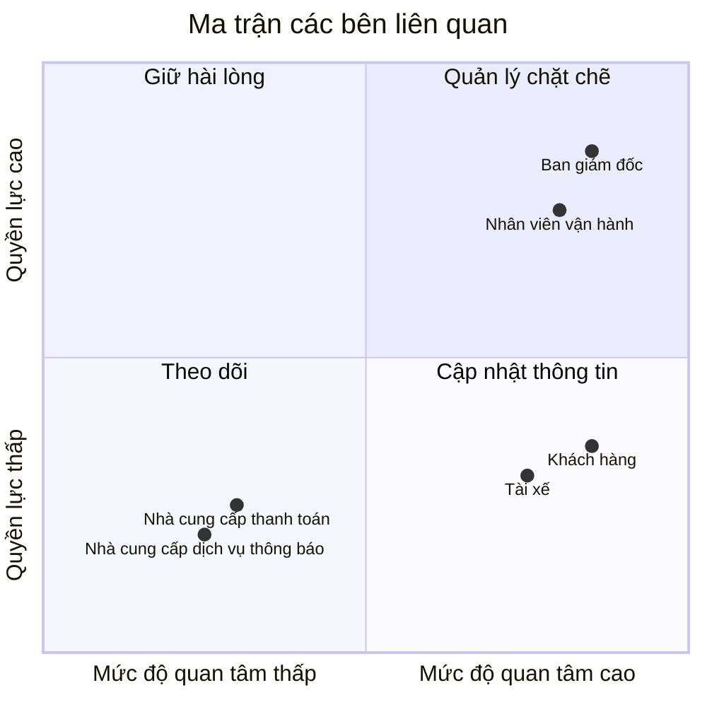

# 23641681_CaoXuanNguyen_cabsystem

## Câu 1: Tìm hiểu nghiệp vụ
### a) Hệ thống hiện tại có những vấn đề gì?
- Việc phân công tài xế chủ yếu vẫn làm thủ công nên có thể mất nhiều thời gian.
- Khách hàng khó theo dõi được trạng thái chuyến đi của mình.
- Thông tin thanh toán chưa được quản lý tập trung.
- Bộ phận vận hành gặp khó khăn khi số lượng khách hàng và tài xế tăng lên.
- Khi tài xế đầu tiên không nhận chuyến thì việc tìm tài xế khác chưa được tự động hóa tốt.
- Khó theo dõi vị trí của tài xế để tìm tài xế gần khách hàng và dự đoán thời gian tài xế đến.
- Hệ thống hiện tại khó mở rộng thêm các chức năng mới trong tương lai.
### b) Mục tiêu chính của hệ thống
- Cho phép khách hàng đặt xe một cách dễ dàng.
- Tự động tìm và phân công tài xế phù hợp cho khách hàng.
- Cho khách hàng theo dõi được trạng thái chuyến đi.
- Cho phép tài xế nhận và cập nhật trạng thái chuyến.
- Hỗ trợ tính cước và thanh toán bằng tiền mặt hoặc thanh toán điện tử.
- Quản lý thông tin khách hàng, tài xế, phương tiện và chuyến đi tập trung.
- Gửi thông báo cho khách hàng và tài xế khi có các sự kiện quan trọng.
- Hỗ trợ nhân viên vận hành theo dõi và xử lý các chuyến đi.
- Có báo cáo về số lượng chuyến, doanh thu, tỷ lệ hoàn thành, tỷ lệ hủy và hiệu quả của tài xế.
- Hệ thống phải có khả năng mở rộng để sau này có thể thêm dịch vụ, phương thức thanh toán hoặc nhà cung cấp thông báo mới.
### c) Vấn đề hiện tại là gì?
- Việc tìm và phân công tài xế mất nhiều thời gian.
- Khách hàng không biết chính xác chuyến xe đang ở trạng thái nào.
- Nhân viên vận hành khó quản lý khi số lượng chuyến tăng.
- Việc thanh toán và thông tin giao dịch chưa được quản lý tốt.
- Hệ thống khó mở rộng khi công ty muốn phát triển thêm.
### d) Ai là người tham gia và sử dụng hệ thống?
#### d.1. Khách hàng (Customer)
- Đăng ký và đăng nhập.
- Cập nhật thông tin cá nhân.
- Nhập điểm đón và điểm đến.
- Chọn loại xe.
- Đặt xe.
- Theo dõi trạng thái chuyến đi.
- Xem thông tin tài xế và thời gian dự kiến tài xế đến.
- Xem lịch sử chuyến đi.
- Xem số tiền cần thanh toán.
- Thanh toán.
- Đánh giá tài xế sau chuyến đi.
#### d.2. Tài xế (Driver)
- Đăng ký tài khoản hoặc được nhân viên tạo tài khoản.
- Cập nhật thông tin cá nhân.
- Cập nhật thông tin phương tiện.
- Chuyển sang trạng thái sẵn sàng nhận chuyến.
- Nhận thông báo khi có chuyến mới.
- Chấp nhận hoặc từ chối chuyến.
- Cập nhật trạng thái chuyến:
  - Đã đến điểm đón.
  - Đã đón khách.
  - Đang di chuyển.
  - Hoàn thành chuyến.
- Hệ thống lưu vị trí của tài xế để hỗ trợ tìm tài xế gần khách hàng.
#### d.3. Nhân viên vận hành (Operation Staff)
- Quản lý khách hàng.
- Quản lý tài xế.
- Quản lý phương tiện.
- Quản lý các chuyến đi.
- Xem các chuyến đang diễn ra.
- Kiểm tra trạng thái của tài xế.
- Hỗ trợ xử lý các chuyến bị lỗi.
- Tra cứu lịch sử giao dịch.
- Theo dõi các báo cáo về hoạt động của hệ thống.
#### d.4. Ban giám đốc (Management)
- Theo dõi số lượng chuyến đi.
- Theo dõi doanh thu.
- Theo dõi tỷ lệ chuyến hoàn thành.
- Theo dõi tỷ lệ chuyến bị hủy.
- Theo dõi hiệu quả hoạt động của tài xế.
- Đưa ra các yêu cầu và định hướng phát triển hệ thống.
- Định hướng mở rộng thêm các loại dịch vụ, phương thức thanh toán và các kênh thông báo trong tương lai.
#### d.5. Nhà cung cấp thanh toán (Payment Provider)
- Xử lý các giao dịch thanh toán điện tử của khách hàng.
- Trả kết quả thanh toán về cho hệ thống CAB.
- Hỗ trợ trường hợp thanh toán thành công hoặc thất bại.
- Hệ thống CAB không lưu trực tiếp các thông tin nhạy cảm của thẻ hoặc tài khoản thanh toán.
- Khi thanh toán thất bại, hệ thống cần thông báo cho khách hàng và cho phép xử lý lại theo chính sách của công ty.
#### d.6. Nhà cung cấp dịch vụ thông báo (Notification Provider)
- Gửi thông báo khi khách hàng tạo yêu cầu đặt xe.
- Thông báo khi có tài xế nhận chuyến.
- Thông báo khi tài xế đến điểm đón.
- Thông báo khi chuyến đi hoàn thành.
- Thông báo kết quả thanh toán.
- Gửi các thông báo liên quan đến thay đổi của chuyến đi cho khách hàng và tài xế.
---
## Câu 2: Các bên liên quan
### Stakeholder
| Tên | Vai trò |
|---|---|
| **Khách hàng (Customer)** | Đăng ký, đặt xe, theo dõi chuyến đi, thanh toán, xem lịch sử và đánh giá tài xế. |
| **Tài xế (Driver)** | Nhận hoặc từ chối chuyến, cập nhật trạng thái chuyến, quản lý thông tin cá nhân và phương tiện, cung cấp vị trí để hệ thống tìm tài xế phù hợp. |
| **Nhân viên vận hành (Operation Staff)** | Quản lý khách hàng, tài xế, phương tiện và chuyến đi; theo dõi chuyến đang diễn ra, xử lý các trường hợp lỗi và tra cứu giao dịch. |
| **Ban giám đốc (Management)** | Theo dõi số lượng chuyến, doanh thu, tỷ lệ hoàn thành/hủy và hiệu quả tài xế; đưa ra định hướng phát triển hệ thống. |
| **Nhà cung cấp thanh toán (Payment Provider)** | Xử lý thanh toán điện tử và trả kết quả giao dịch về hệ thống CAB. |
| **Nhà cung cấp dịch vụ thông báo (Notification Provider)** | Gửi các thông báo liên quan đến đặt xe, tài xế, chuyến đi và thanh toán cho khách hàng và tài xế. |
---
## Câu 3: Ma trận các bên liên quan
### Bảng phân loại

| **Tên** | **Quyền lực** | **Mức độ quan tâm** | **Nhóm** |
|---|---|---|---|
| **Ban giám đốc** | Cao | Cao | Quản lý chặt chẽ |
| **Nhân viên vận hành** | Cao | Cao | Quản lý chặt chẽ |
| **Khách hàng** | Thấp | Cao | Cập nhật thông tin |
| **Tài xế** | Thấp | Cao | Cập nhật thông tin |
| **Nhà cung cấp thanh toán** | Thấp | Thấp | Theo dõi |
| **Nhà cung cấp dịch vụ thông báo** | Thấp | Thấp | Theo dõi |

### Ma trận Quyền lực - Mức độ quan tâm


---
## Câu 4: Phạm vi dự án trong 7 tuần

Dự án tập trung xây dựng các module chính cần thiết để hệ thống CAB có thể thực hiện đầy đủ quy trình đặt xe, quản lý chuyến đi, thanh toán và vận hành hệ thống.

### Các module cần xây dựng

| STT | Module | Chức năng chính |
|---|---|---|
| 1 | **Module xác thực và phân quyền** | Đăng ký, đăng nhập, đăng xuất, phân quyền khách hàng, tài xế, nhân viên vận hành và ban giám đốc. |
| 2 | **Module quản lý khách hàng** | Quản lý thông tin cá nhân, lịch sử đặt xe và lịch sử chuyến đi của khách hàng. |
| 3 | **Module quản lý tài xế** | Quản lý thông tin tài xế, trạng thái hoạt động, trạng thái sẵn sàng nhận chuyến và thông tin liên quan đến tài xế. |
| 4 | **Module quản lý phương tiện** | Quản lý thông tin phương tiện, loại xe và phương tiện của tài xế. |
| 5 | **Module đặt xe** | Nhập điểm đón, điểm đến, chọn loại xe và tạo yêu cầu đặt xe. |
| 6 | **Module tìm kiếm và phân công tài xế** | Tìm tài xế phù hợp, ưu tiên tài xế gần khách hàng, gửi yêu cầu chuyến và tìm tài xế khác khi tài xế từ chối hoặc không phản hồi. |
| 7 | **Module quản lý chuyến đi** | Quản lý trạng thái chuyến từ lúc tạo yêu cầu, nhận chuyến, đón khách, di chuyển, hoàn thành hoặc hủy chuyến. |
| 8 | **Module định vị và theo dõi tài xế** | Cập nhật vị trí tài xế, tìm tài xế gần khách hàng và hỗ trợ dự đoán thời gian tài xế đến. |
| 9 | **Module tính cước** | Tính giá chuyến đi và xác định số tiền khách hàng cần thanh toán. |
| 10 | **Module thanh toán** | Hỗ trợ tiền mặt và thanh toán điện tử, kết nối nhà cung cấp thanh toán, nhận kết quả giao dịch và xử lý thanh toán thất bại. |
| 11 | **Module thông báo** | Gửi thông báo cho khách hàng và tài xế về đặt xe, nhận chuyến, tài xế đến, hoàn thành chuyến và kết quả thanh toán. |
| 12 | **Module đánh giá** | Cho phép khách hàng đánh giá tài xế sau khi hoàn thành chuyến đi. |
| 13 | **Module vận hành** | Cho phép nhân viên vận hành theo dõi chuyến đang diễn ra, quản lý khách hàng, tài xế, phương tiện và hỗ trợ xử lý sự cố. |
| 14 | **Module báo cáo và thống kê** | Thống kê số lượng chuyến, doanh thu, tỷ lệ hoàn thành, tỷ lệ hủy và hiệu quả của tài xế. |
| 15 | **Module quản trị hệ thống** | Quản lý cấu hình hệ thống, người dùng, quyền truy cập và các thiết lập cần thiết cho hệ thống. |

### Quy trình chính của hệ thống

```text
Khách hàng
    ↓
Đặt xe
    ↓
Tìm tài xế
    ↓
Phân công tài xế
    ↓
Tài xế nhận chuyến
    ↓
Tài xế đến điểm đón
    ↓
Đón khách
    ↓
Di chuyển
    ↓
Hoàn thành chuyến
    ↓
Tính cước
    ↓
Thanh toán
    ↓
Đánh giá tài xế
```
## Câu 5: Chuyển các yêu cầu thành yêu cầu nghiệp vụ (Business Requirement)

### 5.1. Danh sách Business Requirement

| Mã | Nhóm nghiệp vụ | Yêu cầu nghiệp vụ |
|---|---|---|
| **BR01** | Quản lý người dùng | Hệ thống cho phép người dùng đăng ký, đăng nhập, đăng xuất và quản lý thông tin tài khoản. |
| **BR02** | Quản lý khách hàng | Hệ thống cho phép quản lý thông tin khách hàng và lịch sử sử dụng dịch vụ. |
| **BR03** | Quản lý tài xế | Hệ thống cho phép quản lý thông tin tài xế, trạng thái hoạt động và khả năng nhận chuyến. |
| **BR04** | Quản lý phương tiện | Hệ thống cho phép quản lý thông tin phương tiện và loại xe của tài xế. |
| **BR05** | Đặt xe | Hệ thống cho phép khách hàng nhập điểm đón, điểm đến, chọn loại xe và tạo yêu cầu đặt xe. |
| **BR06** | Tìm tài xế | Hệ thống tự động tìm tài xế phù hợp dựa trên trạng thái sẵn sàng và vị trí của tài xế. |
| **BR07** | Phân công tài xế | Hệ thống tự động gửi yêu cầu chuyến cho tài xế phù hợp và tìm tài xế khác khi tài xế từ chối hoặc không phản hồi. |
| **BR08** | Quản lý chuyến đi | Hệ thống quản lý toàn bộ trạng thái chuyến đi từ lúc tạo yêu cầu đến khi hoàn thành hoặc hủy chuyến. |
| **BR09** | Theo dõi tài xế | Hệ thống cập nhật vị trí tài xế để hỗ trợ tìm tài xế gần khách hàng và dự kiến thời gian tài xế đến. |
| **BR10** | Tính cước | Hệ thống tính số tiền khách hàng cần thanh toán cho chuyến đi. |
| **BR11** | Thanh toán | Hệ thống hỗ trợ thanh toán bằng tiền mặt và thanh toán điện tử. |
| **BR12** | Xử lý thanh toán | Hệ thống ghi nhận kết quả thanh toán thành công hoặc thất bại và xử lý phù hợp. |
| **BR13** | Thông báo | Hệ thống gửi thông báo cho khách hàng và tài xế khi có các sự kiện quan trọng. |
| **BR14** | Đánh giá | Hệ thống cho phép khách hàng đánh giá tài xế sau khi chuyến đi hoàn thành. |
| **BR15** | Vận hành | Hệ thống hỗ trợ nhân viên vận hành quản lý khách hàng, tài xế, phương tiện và chuyến đi. |
| **BR16** | Xử lý sự cố | Hệ thống hỗ trợ nhân viên vận hành kiểm tra và xử lý các chuyến đi gặp vấn đề. |
| **BR17** | Báo cáo | Hệ thống cung cấp báo cáo về số lượng chuyến, doanh thu, tỷ lệ hoàn thành, tỷ lệ hủy và hiệu quả của tài xế. |
| **BR18** | Phân quyền | Hệ thống phân quyền người dùng theo từng vai trò và giới hạn chức năng tương ứng. |
| **BR19** | Nhà cung cấp thanh toán | Hệ thống có khả năng kết nối với nhà cung cấp thanh toán bên ngoài để xử lý thanh toán điện tử. |
| **BR20** | Nhà cung cấp thông báo | Hệ thống có khả năng kết nối với nhà cung cấp dịch vụ thông báo bên ngoài. |
| **BR21** | Khả năng mở rộng | Hệ thống có khả năng mở rộng thêm loại dịch vụ, phương thức thanh toán và nhà cung cấp trong tương lai. |

### 5.2. Business Requirement theo từng bên liên quan

| Bên liên quan | Business Requirement chính |
|---|---|
| **Khách hàng** | Đăng ký tài khoản, đặt xe, theo dõi chuyến đi, xem thông tin tài xế, thanh toán và đánh giá tài xế. |
| **Tài xế** | Quản lý thông tin cá nhân và phương tiện, nhận hoặc từ chối chuyến, cập nhật trạng thái chuyến và vị trí. |
| **Nhân viên vận hành** | Quản lý khách hàng, tài xế, phương tiện, chuyến đi, giao dịch và xử lý các trường hợp lỗi. |
| **Ban giám đốc** | Theo dõi số lượng chuyến, doanh thu, tỷ lệ hoàn thành, tỷ lệ hủy và hiệu quả hoạt động của tài xế. |
| **Nhà cung cấp thanh toán** | Xử lý các giao dịch thanh toán điện tử và trả kết quả giao dịch về hệ thống CAB. |
| **Nhà cung cấp dịch vụ thông báo** | Gửi thông báo liên quan đến đặt xe, tài xế, chuyến đi và thanh toán. |

