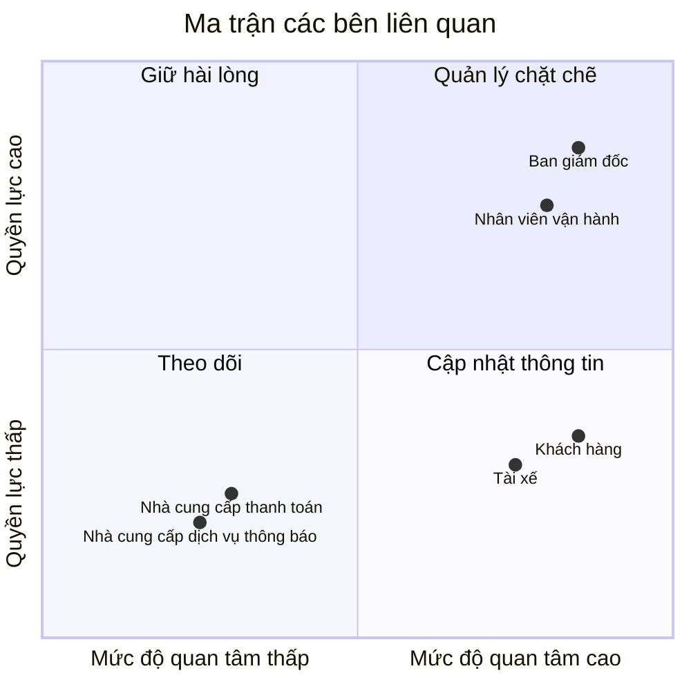
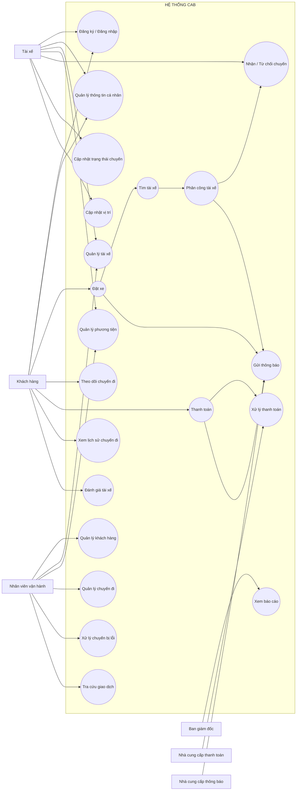
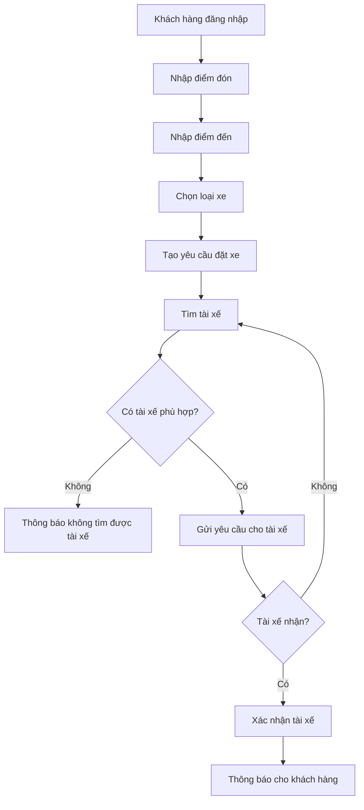
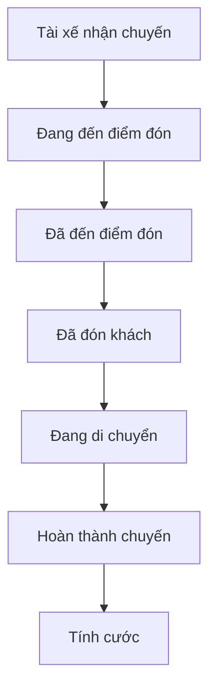
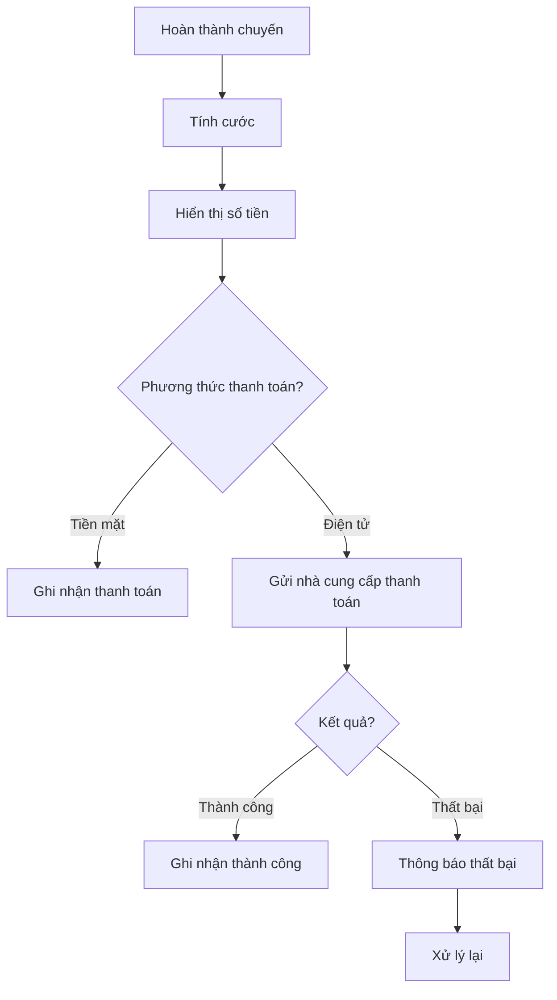
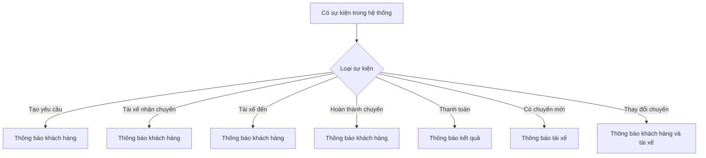
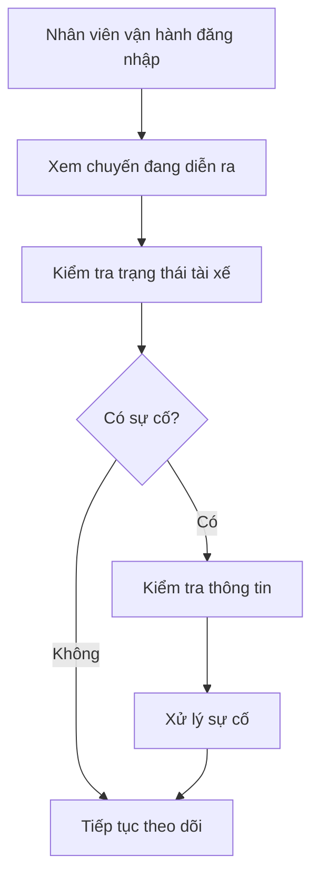
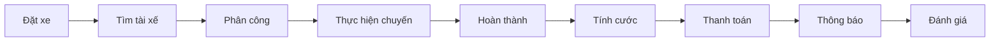

# 23641681_CaoXuanNguyen_cabsystem

## Câu 1: Tìm hiểu nghiệp vụ
### a) Hệ thống hiện tại có những vấn đề gì?
- Việc phân công tài xế chủ yếu vẫn làm thủ công nên có thể mất nhiều thời gian.
- Khách hàng khó theo dõi được trạng thái chuyến đi của mình.
- Thông tin thanh toán chưa được quản lý tập trung.
- Bộ phận vận hành gặp khó khăn khi số lượng khách hàng và tài xế tăng lên.
- Khi tài xế đầu tiên không nhận chuyến thì việc tìm tài xế khác chưa được tự động hóa tốt.
- Khó theo dõi vị trí của tài xế để tìm tài xế gần khách hàng và dự đoán thời gian tài xế đến.
- Hệ thống hiện tại khó mở rộng thêm các chức năng mới trong tương lai.
### b) Mục tiêu chính của hệ thống
- Cho phép khách hàng đặt xe một cách dễ dàng.
- Tự động tìm và phân công tài xế phù hợp cho khách hàng.
- Cho khách hàng theo dõi được trạng thái chuyến đi.
- Cho phép tài xế nhận và cập nhật trạng thái chuyến.
- Hỗ trợ tính cước và thanh toán bằng tiền mặt hoặc thanh toán điện tử.
- Quản lý thông tin khách hàng, tài xế, phương tiện và chuyến đi tập trung.
- Gửi thông báo cho khách hàng và tài xế khi có các sự kiện quan trọng.
- Hỗ trợ nhân viên vận hành theo dõi và xử lý các chuyến đi.
- Có báo cáo về số lượng chuyến, doanh thu, tỷ lệ hoàn thành, tỷ lệ hủy và hiệu quả của tài xế.
- Hệ thống phải có khả năng mở rộng để sau này có thể thêm dịch vụ, phương thức thanh toán hoặc nhà cung cấp thông báo mới.
### c) Vấn đề hiện tại là gì?
- Việc tìm và phân công tài xế mất nhiều thời gian.
- Khách hàng không biết chính xác chuyến xe đang ở trạng thái nào.
- Nhân viên vận hành khó quản lý khi số lượng chuyến tăng.
- Việc thanh toán và thông tin giao dịch chưa được quản lý tốt.
- Hệ thống khó mở rộng khi công ty muốn phát triển thêm.
### d) Ai là người tham gia và sử dụng hệ thống?
#### d.1. Khách hàng (Customer)
- Đăng ký và đăng nhập.
- Cập nhật thông tin cá nhân.
- Nhập điểm đón và điểm đến.
- Chọn loại xe.
- Đặt xe.
- Theo dõi trạng thái chuyến đi.
- Xem thông tin tài xế và thời gian dự kiến tài xế đến.
- Xem lịch sử chuyến đi.
- Xem số tiền cần thanh toán.
- Thanh toán.
- Đánh giá tài xế sau chuyến đi.
#### d.2. Tài xế (Driver)
- Đăng ký tài khoản hoặc được nhân viên tạo tài khoản.
- Cập nhật thông tin cá nhân.
- Cập nhật thông tin phương tiện.
- Chuyển sang trạng thái sẵn sàng nhận chuyến.
- Nhận thông báo khi có chuyến mới.
- Chấp nhận hoặc từ chối chuyến.
- Cập nhật trạng thái chuyến:
  - Đã đến điểm đón.
  - Đã đón khách.
  - Đang di chuyển.
  - Hoàn thành chuyến.
- Hệ thống lưu vị trí của tài xế để hỗ trợ tìm tài xế gần khách hàng.
#### d.3. Nhân viên vận hành (Operation Staff)
- Quản lý khách hàng.
- Quản lý tài xế.
- Quản lý phương tiện.
- Quản lý các chuyến đi.
- Xem các chuyến đang diễn ra.
- Kiểm tra trạng thái của tài xế.
- Hỗ trợ xử lý các chuyến bị lỗi.
- Tra cứu lịch sử giao dịch.
- Theo dõi các báo cáo về hoạt động của hệ thống.
#### d.4. Ban giám đốc (Management)
- Theo dõi số lượng chuyến đi.
- Theo dõi doanh thu.
- Theo dõi tỷ lệ chuyến hoàn thành.
- Theo dõi tỷ lệ chuyến bị hủy.
- Theo dõi hiệu quả hoạt động của tài xế.
- Đưa ra các yêu cầu và định hướng phát triển hệ thống.
- Định hướng mở rộng thêm các loại dịch vụ, phương thức thanh toán và các kênh thông báo trong tương lai.
#### d.5. Nhà cung cấp thanh toán (Payment Provider)
- Xử lý các giao dịch thanh toán điện tử của khách hàng.
- Trả kết quả thanh toán về cho hệ thống CAB.
- Hỗ trợ trường hợp thanh toán thành công hoặc thất bại.
- Hệ thống CAB không lưu trực tiếp các thông tin nhạy cảm của thẻ hoặc tài khoản thanh toán.
- Khi thanh toán thất bại, hệ thống cần thông báo cho khách hàng và cho phép xử lý lại theo chính sách của công ty.
#### d.6. Nhà cung cấp dịch vụ thông báo (Notification Provider)
- Gửi thông báo khi khách hàng tạo yêu cầu đặt xe.
- Thông báo khi có tài xế nhận chuyến.
- Thông báo khi tài xế đến điểm đón.
- Thông báo khi chuyến đi hoàn thành.
- Thông báo kết quả thanh toán.
- Gửi các thông báo liên quan đến thay đổi của chuyến đi cho khách hàng và tài xế.
---
## Câu 2: Các bên liên quan
### Stakeholder
| Tên | Vai trò |
|---|---|
| **Khách hàng (Customer)** | Đăng ký, đặt xe, theo dõi chuyến đi, thanh toán, xem lịch sử và đánh giá tài xế. |
| **Tài xế (Driver)** | Nhận hoặc từ chối chuyến, cập nhật trạng thái chuyến, quản lý thông tin cá nhân và phương tiện, cung cấp vị trí để hệ thống tìm tài xế phù hợp. |
| **Nhân viên vận hành (Operation Staff)** | Quản lý khách hàng, tài xế, phương tiện và chuyến đi; theo dõi chuyến đang diễn ra, xử lý các trường hợp lỗi và tra cứu giao dịch. |
| **Ban giám đốc (Management)** | Theo dõi số lượng chuyến, doanh thu, tỷ lệ hoàn thành/hủy và hiệu quả tài xế; đưa ra định hướng phát triển hệ thống. |
| **Nhà cung cấp thanh toán (Payment Provider)** | Xử lý thanh toán điện tử và trả kết quả giao dịch về hệ thống CAB. |
| **Nhà cung cấp dịch vụ thông báo (Notification Provider)** | Gửi các thông báo liên quan đến đặt xe, tài xế, chuyến đi và thanh toán cho khách hàng và tài xế. |
---
## Câu 3: Ma trận các bên liên quan
### Bảng phân loại

| **Tên** | **Quyền lực** | **Mức độ quan tâm** | **Nhóm** |
|---|---|---|---|
| **Ban giám đốc** | Cao | Cao | Quản lý chặt chẽ |
| **Nhân viên vận hành** | Cao | Cao | Quản lý chặt chẽ |
| **Khách hàng** | Thấp | Cao | Cập nhật thông tin |
| **Tài xế** | Thấp | Cao | Cập nhật thông tin |
| **Nhà cung cấp thanh toán** | Thấp | Thấp | Theo dõi |
| **Nhà cung cấp dịch vụ thông báo** | Thấp | Thấp | Theo dõi |

### Ma trận Quyền lực - Mức độ quan tâm


---
## Câu 4: Phạm vi dự án trong 7 tuần

Dự án tập trung xây dựng các module chính cần thiết để hệ thống CAB có thể thực hiện đầy đủ quy trình đặt xe, quản lý chuyến đi, thanh toán và vận hành hệ thống.

### Các module cần xây dựng

| STT | Module | Chức năng chính |
|---|---|---|
| 1 | **Module xác thực và phân quyền** | Đăng ký, đăng nhập, đăng xuất, phân quyền khách hàng, tài xế, nhân viên vận hành và ban giám đốc. |
| 2 | **Module quản lý khách hàng** | Quản lý thông tin cá nhân, lịch sử đặt xe và lịch sử chuyến đi của khách hàng. |
| 3 | **Module quản lý tài xế** | Quản lý thông tin tài xế, trạng thái hoạt động, trạng thái sẵn sàng nhận chuyến và thông tin liên quan đến tài xế. |
| 4 | **Module quản lý phương tiện** | Quản lý thông tin phương tiện, loại xe và phương tiện của tài xế. |
| 5 | **Module đặt xe** | Nhập điểm đón, điểm đến, chọn loại xe và tạo yêu cầu đặt xe. |
| 6 | **Module tìm kiếm và phân công tài xế** | Tìm tài xế phù hợp, ưu tiên tài xế gần khách hàng, gửi yêu cầu chuyến và tìm tài xế khác khi tài xế từ chối hoặc không phản hồi. |
| 7 | **Module quản lý chuyến đi** | Quản lý trạng thái chuyến từ lúc tạo yêu cầu, nhận chuyến, đón khách, di chuyển, hoàn thành hoặc hủy chuyến. |
| 8 | **Module định vị và theo dõi tài xế** | Cập nhật vị trí tài xế, tìm tài xế gần khách hàng và hỗ trợ dự đoán thời gian tài xế đến. |
| 9 | **Module tính cước** | Tính giá chuyến đi và xác định số tiền khách hàng cần thanh toán. |
| 10 | **Module thanh toán** | Hỗ trợ tiền mặt và thanh toán điện tử, kết nối nhà cung cấp thanh toán, nhận kết quả giao dịch và xử lý thanh toán thất bại. |
| 11 | **Module thông báo** | Gửi thông báo cho khách hàng và tài xế về đặt xe, nhận chuyến, tài xế đến, hoàn thành chuyến và kết quả thanh toán. |
| 12 | **Module đánh giá** | Cho phép khách hàng đánh giá tài xế sau khi hoàn thành chuyến đi. |
| 13 | **Module vận hành** | Cho phép nhân viên vận hành theo dõi chuyến đang diễn ra, quản lý khách hàng, tài xế, phương tiện và hỗ trợ xử lý sự cố. |
| 14 | **Module báo cáo và thống kê** | Thống kê số lượng chuyến, doanh thu, tỷ lệ hoàn thành, tỷ lệ hủy và hiệu quả của tài xế. |
| 15 | **Module quản trị hệ thống** | Quản lý cấu hình hệ thống, người dùng, quyền truy cập và các thiết lập cần thiết cho hệ thống. |

### Quy trình chính của hệ thống

```text
Khách hàng
    ↓
Đặt xe
    ↓
Tìm tài xế
    ↓
Phân công tài xế
    ↓
Tài xế nhận chuyến
    ↓
Tài xế đến điểm đón
    ↓
Đón khách
    ↓
Di chuyển
    ↓
Hoàn thành chuyến
    ↓
Tính cước
    ↓
Thanh toán
    ↓
Đánh giá tài xế
```
## Câu 5: Chuyển các yêu cầu thành yêu cầu nghiệp vụ (Business Requirement)
### 5.1. Danh sách Business Requirement
| Mã | Nhóm nghiệp vụ | Yêu cầu nghiệp vụ |
|---|---|---|
| **BR01** | Quản lý người dùng | Hệ thống cho phép người dùng đăng ký, đăng nhập, đăng xuất và quản lý thông tin tài khoản. |
| **BR02** | Quản lý khách hàng | Hệ thống cho phép quản lý thông tin khách hàng và lịch sử sử dụng dịch vụ. |
| **BR03** | Quản lý tài xế | Hệ thống cho phép quản lý thông tin tài xế, trạng thái hoạt động và khả năng nhận chuyến. |
| **BR04** | Quản lý phương tiện | Hệ thống cho phép quản lý thông tin phương tiện và loại xe của tài xế. |
| **BR05** | Đặt xe | Hệ thống cho phép khách hàng nhập điểm đón, điểm đến, chọn loại xe và tạo yêu cầu đặt xe. |
| **BR06** | Tìm tài xế | Hệ thống tự động tìm tài xế phù hợp dựa trên trạng thái sẵn sàng và vị trí của tài xế. |
| **BR07** | Phân công tài xế | Hệ thống tự động gửi yêu cầu chuyến cho tài xế phù hợp và tìm tài xế khác khi tài xế từ chối hoặc không phản hồi. |
| **BR08** | Quản lý chuyến đi | Hệ thống quản lý toàn bộ trạng thái chuyến đi từ lúc tạo yêu cầu đến khi hoàn thành hoặc hủy chuyến. |
| **BR09** | Theo dõi tài xế | Hệ thống cập nhật vị trí tài xế để hỗ trợ tìm tài xế gần khách hàng và dự kiến thời gian tài xế đến. |
| **BR10** | Tính cước | Hệ thống tính số tiền khách hàng cần thanh toán cho chuyến đi. |
| **BR11** | Thanh toán | Hệ thống hỗ trợ thanh toán bằng tiền mặt và thanh toán điện tử. |
| **BR12** | Xử lý thanh toán | Hệ thống ghi nhận kết quả thanh toán thành công hoặc thất bại và xử lý phù hợp. |
| **BR13** | Thông báo | Hệ thống gửi thông báo cho khách hàng và tài xế khi có các sự kiện quan trọng. |
| **BR14** | Đánh giá | Hệ thống cho phép khách hàng đánh giá tài xế sau khi chuyến đi hoàn thành. |
| **BR15** | Vận hành | Hệ thống hỗ trợ nhân viên vận hành quản lý khách hàng, tài xế, phương tiện và chuyến đi. |
| **BR16** | Xử lý sự cố | Hệ thống hỗ trợ nhân viên vận hành kiểm tra và xử lý các chuyến đi gặp vấn đề. |
| **BR17** | Báo cáo | Hệ thống cung cấp báo cáo về số lượng chuyến, doanh thu, tỷ lệ hoàn thành, tỷ lệ hủy và hiệu quả của tài xế. |
| **BR18** | Phân quyền | Hệ thống phân quyền người dùng theo từng vai trò và giới hạn chức năng tương ứng. |
| **BR19** | Nhà cung cấp thanh toán | Hệ thống có khả năng kết nối với nhà cung cấp thanh toán bên ngoài để xử lý thanh toán điện tử. |
| **BR20** | Nhà cung cấp thông báo | Hệ thống có khả năng kết nối với nhà cung cấp dịch vụ thông báo bên ngoài. |
| **BR21** | Khả năng mở rộng | Hệ thống có khả năng mở rộng thêm loại dịch vụ, phương thức thanh toán và nhà cung cấp trong tương lai. |

### 5.2. Business Requirement theo từng bên liên quan
| Bên liên quan | Business Requirement chính |
|---|---|
| **Khách hàng** | Đăng ký tài khoản, đặt xe, theo dõi chuyến đi, xem thông tin tài xế, thanh toán và đánh giá tài xế. |
| **Tài xế** | Quản lý thông tin cá nhân và phương tiện, nhận hoặc từ chối chuyến, cập nhật trạng thái chuyến và vị trí. |
| **Nhân viên vận hành** | Quản lý khách hàng, tài xế, phương tiện, chuyến đi, giao dịch và xử lý các trường hợp lỗi. |
| **Ban giám đốc** | Theo dõi số lượng chuyến, doanh thu, tỷ lệ hoàn thành, tỷ lệ hủy và hiệu quả hoạt động của tài xế. |
| **Nhà cung cấp thanh toán** | Xử lý các giao dịch thanh toán điện tử và trả kết quả giao dịch về hệ thống CAB. |
| **Nhà cung cấp dịch vụ thông báo** | Gửi thông báo liên quan đến đặt xe, tài xế, chuyến đi và thanh toán. |

## Câu 6: Phân rã các yêu cầu chức năng
### FR01 - Quản lý người dùng
- Đăng ký tài khoản.
- Đăng nhập.
- Đăng xuất.
- Xác thực tài khoản.
- Cập nhật thông tin cá nhân.
- Quản lý thông tin tài khoản.
- Xác định vai trò người dùng.
- Kiểm tra quyền truy cập.
### FR02 - Quản lý khách hàng
- Tạo thông tin khách hàng.
- Cập nhật thông tin khách hàng.
- Xem thông tin khách hàng.
- Tìm kiếm khách hàng.
- Xem lịch sử chuyến đi.
- Xem lịch sử thanh toán.
### FR03 - Quản lý tài xế
- Tạo thông tin tài xế.
- Cập nhật thông tin tài xế.
- Xem thông tin tài xế.
- Cập nhật trạng thái hoạt động.
- Cập nhật trạng thái sẵn sàng nhận chuyến.
- Cập nhật vị trí tài xế.
- Xem lịch sử chuyến đi của tài xế.
### FR04 - Quản lý phương tiện
- Thêm phương tiện.
- Cập nhật thông tin phương tiện.
- Xem thông tin phương tiện.
- Xác định loại xe.
- Gán phương tiện cho tài xế.
- Thay đổi phương tiện của tài xế.
- Kiểm tra trạng thái phương tiện.
### FR05 - Đặt xe
- Nhập điểm đón.
- Nhập điểm đến.
- Chọn loại xe.
- Tạo yêu cầu đặt xe.
- Kiểm tra thông tin yêu cầu.
- Xác nhận đặt xe.
- Hủy yêu cầu đặt xe.
- Hiển thị trạng thái yêu cầu đặt xe.
### FR06 - Tìm tài xế
- Xác định vị trí điểm đón.
- Xác định các tài xế đang sẵn sàng.
- Kiểm tra tài xế có loại xe phù hợp.
- Lấy vị trí hiện tại của tài xế.
- Tính khoảng cách giữa tài xế và khách hàng.
- Xác định tài xế phù hợp.
- Ưu tiên tài xế gần khách hàng.
- Gửi yêu cầu nhận chuyến đến tài xế.
- Chờ tài xế phản hồi.
- Ghi nhận kết quả phản hồi.
- Tiếp tục tìm tài xế khác nếu tài xế từ chối.
- Tiếp tục tìm tài xế khác nếu tài xế không phản hồi.
- Thông báo cho khách hàng khi không tìm được tài xế.
### FR07 - Phân công tài xế
- Gửi yêu cầu chuyến cho tài xế.
- Ghi nhận tài xế nhận chuyến.
- Ghi nhận tài xế từ chối chuyến.
- Kiểm tra thời gian phản hồi của tài xế.
- Xử lý trường hợp tài xế không phản hồi.
- Chuyển yêu cầu sang tài xế tiếp theo.
- Xác nhận tài xế được phân công.
- Thông báo tài xế cho khách hàng.
- Thông báo kết quả phân công.
### FR08 - Quản lý chuyến đi
- Tạo chuyến đi.
- Gán khách hàng vào chuyến đi.
- Gán tài xế vào chuyến đi.
- Cập nhật trạng thái chuyến.
- Theo dõi trạng thái chuyến.
- Ghi nhận tài xế đã đến điểm đón.
- Ghi nhận tài xế đã đón khách.
- Ghi nhận chuyến đang di chuyển.
- Ghi nhận chuyến hoàn thành.
- Hủy chuyến.
- Lưu lịch sử chuyến đi.
### FR09 - Theo dõi vị trí tài xế
- Nhận vị trí của tài xế.
- Cập nhật vị trí tài xế.
- Lưu thông tin vị trí.
- Hiển thị vị trí tài xế.
- Tính khoảng cách giữa tài xế và điểm đón.
- Cập nhật thời gian dự kiến tài xế đến.
- Theo dõi vị trí trong quá trình thực hiện chuyến.
### FR10 - Tính cước
- Xác định loại dịch vụ.
- Lấy thông tin chuyến đi.
- Xác định thông tin cần dùng để tính cước.
- Tính số tiền chuyến đi.
- Hiển thị số tiền cần thanh toán.
- Lưu thông tin cước.
- Liên kết thông tin cước với chuyến đi.
### FR11 - Thanh toán
- Hiển thị số tiền cần thanh toán.
- Chọn phương thức thanh toán.
- Thanh toán bằng tiền mặt.
- Thanh toán bằng phương thức điện tử.
- Tạo giao dịch thanh toán.
- Gửi giao dịch đến nhà cung cấp thanh toán.
- Nhận kết quả giao dịch.
- Cập nhật trạng thái thanh toán.
### FR12 - Xử lý thanh toán
- Ghi nhận thanh toán thành công.
- Ghi nhận thanh toán thất bại.
- Hiển thị kết quả thanh toán.
- Gửi thông báo kết quả thanh toán.
- Lưu lịch sử giao dịch.
- Cho phép xử lý lại khi thanh toán thất bại.
- Không lưu trực tiếp thông tin nhạy cảm của thẻ hoặc tài khoản thanh toán.
### FR13 - Thông báo
- Xác định sự kiện cần thông báo.
- Gửi thông báo khi yêu cầu đặt xe được tiếp nhận.
- Gửi thông báo khi có tài xế nhận chuyến.
- Gửi thông báo khi tài xế đến điểm đón.
- Gửi thông báo khi chuyến hoàn thành.
- Gửi thông báo kết quả thanh toán.
- Gửi thông báo chuyến mới cho tài xế.
- Gửi thông báo khi chuyến có thay đổi.
- Ghi nhận trạng thái gửi thông báo.
### FR14 - Đánh giá tài xế
- Cho phép khách hàng đánh giá sau khi hoàn thành chuyến.
- Nhập mức đánh giá.
- Lưu thông tin đánh giá.
- Liên kết đánh giá với chuyến đi.
- Liên kết đánh giá với tài xế.
- Xem kết quả đánh giá.
### FR15 - Quản lý vận hành
- Xem danh sách khách hàng.
- Xem danh sách tài xế.
- Xem danh sách phương tiện.
- Xem danh sách chuyến đi.
- Xem các chuyến đang diễn ra.
- Kiểm tra trạng thái tài xế.
- Kiểm tra trạng thái chuyến.
- Tra cứu lịch sử giao dịch.
- Hỗ trợ xử lý chuyến gặp lỗi.
### FR16 - Xử lý sự cố
- Xác định chuyến đi gặp sự cố.
- Xem thông tin chuyến gặp sự cố.
- Kiểm tra trạng thái hiện tại.
- Cập nhật trạng thái xử lý.
- Hỗ trợ xử lý chuyến.
- Lưu lịch sử xử lý sự cố.
### FR17 - Báo cáo
- Thống kê số lượng chuyến.
- Thống kê doanh thu.
- Tính tỷ lệ chuyến hoàn thành.
- Tính tỷ lệ chuyến hủy.
- Thống kê hiệu quả hoạt động của tài xế.
- Lọc dữ liệu báo cáo.
- Xem báo cáo.
### FR18 - Phân quyền
- Xác định vai trò người dùng.
- Cấp quyền theo vai trò.
- Kiểm tra quyền trước khi thực hiện chức năng.
- Giới hạn chức năng theo quyền.
- Kiểm soát các thao tác quản trị.
- Ghi nhận các thao tác quan trọng.
### FR19 - Tích hợp thanh toán
- Kết nối với nhà cung cấp thanh toán.
- Gửi yêu cầu thanh toán.
- Nhận kết quả thanh toán.
- Xử lý giao dịch thành công.
- Xử lý giao dịch thất bại.
- Xử lý lỗi kết nối.
- Bảo vệ thông tin thanh toán nhạy cảm.
### FR20 - Tích hợp thông báo
- Kết nối với nhà cung cấp dịch vụ thông báo.
- Gửi yêu cầu gửi thông báo.
- Nhận trạng thái gửi.
- Xử lý lỗi gửi thông báo.
- Hỗ trợ thêm kênh thông báo mới.
### FR21 - Khả năng mở rộng
- Hỗ trợ thêm loại dịch vụ mới.
- Hỗ trợ thêm phương thức thanh toán mới.
- Hỗ trợ thêm nhà cung cấp thanh toán.
- Hỗ trợ thêm nhà cung cấp thông báo.
- Cho phép triển khai chức năng mới từng phần.
- Hạn chế ảnh hưởng đến các chức năng đang hoạt động.
# Bước 7: Vẽ Use Case Diagram

## 7.1. Các tác nhân

| Tác nhân | Vai trò |
|---|---|
| **Khách hàng** | Đăng ký, đặt xe, theo dõi chuyến đi, thanh toán và đánh giá tài xế. |
| **Tài xế** | Quản lý thông tin, nhận hoặc từ chối chuyến, cập nhật trạng thái và vị trí. |
| **Nhân viên vận hành** | Quản lý khách hàng, tài xế, phương tiện, chuyến đi và xử lý sự cố. |
| **Ban giám đốc** | Theo dõi báo cáo và hoạt động của hệ thống. |
| **Nhà cung cấp thanh toán** | Xử lý thanh toán điện tử. |
| **Nhà cung cấp dịch vụ thông báo** | Gửi thông báo cho khách hàng và tài xế. |

## 7.2. Use Case Diagram



## 7.3. Nhóm Use Case theo tác nhân

### Khách hàng

- Đăng ký / Đăng nhập.
- Quản lý thông tin cá nhân.
- Đặt xe.
- Theo dõi chuyến đi.
- Xem lịch sử chuyến đi.
- Thanh toán.
- Đánh giá tài xế.

### Tài xế

- Đăng ký / Đăng nhập.
- Quản lý thông tin cá nhân.
- Quản lý phương tiện.
- Nhận hoặc từ chối chuyến.
- Cập nhật trạng thái chuyến.
- Cập nhật vị trí.

### Nhân viên vận hành

- Quản lý khách hàng.
- Quản lý tài xế.
- Quản lý phương tiện.
- Quản lý chuyến đi.
- Xử lý chuyến bị lỗi.
- Tra cứu giao dịch.

### Ban giám đốc

- Xem báo cáo.

### Nhà cung cấp thanh toán

- Xử lý thanh toán điện tử.

### Nhà cung cấp thông báo

- Gửi thông báo.

---

# Bước 8: Đặc tả Use Case

## 8.1. UC01 - Đăng nhập

| Thành phần | Nội dung |
|---|---|
| **Tác nhân** | Khách hàng, Tài xế, Nhân viên vận hành, Ban giám đốc |
| **Mục đích** | Cho phép người dùng truy cập hệ thống. |
| **Điều kiện trước** | Người dùng đã có tài khoản. |
| **Kết quả** | Đăng nhập thành công và truy cập chức năng phù hợp. |

### Luồng chính

1. Người dùng nhập thông tin đăng nhập.
2. Hệ thống kiểm tra tài khoản.
3. Hệ thống xác thực thông tin.
4. Hệ thống xác định vai trò.
5. Hệ thống cho phép truy cập.

### Ngoại lệ

- Sai tài khoản hoặc mật khẩu → thông báo lỗi.
- Tài khoản không hoạt động → từ chối đăng nhập.

## 8.2. UC02 - Đặt xe

| Thành phần | Nội dung |
|---|---|
| **Tác nhân** | Khách hàng |
| **Mục đích** | Tạo yêu cầu đặt xe. |
| **Điều kiện trước** | Khách hàng đã đăng nhập. |
| **Kết quả** | Yêu cầu đặt xe được tạo. |

### Luồng chính

1. Khách hàng nhập điểm đón.
2. Khách hàng nhập điểm đến.
3. Khách hàng chọn loại xe.
4. Hệ thống kiểm tra thông tin.
5. Khách hàng xác nhận đặt xe.
6. Hệ thống tạo yêu cầu.
7. Hệ thống chuyển sang tìm tài xế.

### Ngoại lệ

- Thiếu điểm đón hoặc điểm đến → yêu cầu nhập lại.
- Thông tin không hợp lệ → thông báo lỗi.

## 8.3. UC03 - Tìm và phân công tài xế

| Thành phần | Nội dung |
|---|---|
| **Tác nhân** | Hệ thống, Tài xế |
| **Mục đích** | Tìm tài xế phù hợp và phân công chuyến. |
| **Điều kiện trước** | Đã có yêu cầu đặt xe. |
| **Kết quả** | Có tài xế được phân công hoặc thông báo không tìm được tài xế. |

### Luồng chính

1. Hệ thống lấy vị trí điểm đón.
2. Hệ thống tìm tài xế đang sẵn sàng.
3. Hệ thống kiểm tra loại xe.
4. Hệ thống xác định tài xế phù hợp.
5. Hệ thống gửi yêu cầu chuyến.
6. Tài xế phản hồi.
7. Nếu tài xế chấp nhận, hệ thống xác nhận phân công.
8. Hệ thống thông báo cho khách hàng.

### Ngoại lệ

- Tài xế từ chối → tìm tài xế khác.
- Tài xế không phản hồi → tìm tài xế khác.
- Không còn tài xế phù hợp → thông báo cho khách hàng.

## 8.4. UC04 - Thực hiện chuyến đi

| Thành phần | Nội dung |
|---|---|
| **Tác nhân** | Tài xế, Khách hàng |
| **Mục đích** | Thực hiện và cập nhật trạng thái chuyến. |
| **Điều kiện trước** | Tài xế đã nhận chuyến. |
| **Kết quả** | Chuyến hoàn thành hoặc bị hủy. |

### Luồng chính

1. Tài xế nhận chuyến.
2. Tài xế di chuyển đến điểm đón.
3. Tài xế cập nhật đã đến.
4. Tài xế đón khách.
5. Tài xế cập nhật đã đón khách.
6. Tài xế bắt đầu di chuyển.
7. Tài xế hoàn thành chuyến.
8. Hệ thống cập nhật trạng thái hoàn thành.

### Ngoại lệ

- Chuyến bị hủy → hệ thống cập nhật trạng thái hủy.
- Chuyến gặp lỗi → chuyển cho nhân viên vận hành xử lý.

## 8.5. UC05 - Theo dõi chuyến đi

| Thành phần | Nội dung |
|---|---|
| **Tác nhân** | Khách hàng |
| **Mục đích** | Theo dõi trạng thái chuyến và tài xế. |
| **Điều kiện trước** | Khách hàng có chuyến đi. |
| **Kết quả** | Hiển thị trạng thái và thông tin tài xế. |

### Luồng chính

1. Khách hàng mở thông tin chuyến.
2. Hệ thống hiển thị trạng thái.
3. Hệ thống hiển thị thông tin tài xế.
4. Hệ thống cập nhật vị trí tài xế.
5. Hệ thống hiển thị thời gian dự kiến đến.

## 8.6. UC06 - Thanh toán

| Thành phần | Nội dung |
|---|---|
| **Tác nhân** | Khách hàng, Nhà cung cấp thanh toán |
| **Mục đích** | Thanh toán chi phí chuyến đi. |
| **Điều kiện trước** | Chuyến đã hoàn thành và có số tiền cần thanh toán. |
| **Kết quả** | Giao dịch thành công hoặc thất bại. |

### Luồng chính

1. Khách hàng xem số tiền.
2. Chọn phương thức thanh toán.
3. Nếu tiền mặt → hệ thống ghi nhận thanh toán.
4. Nếu điện tử → hệ thống gửi giao dịch.
5. Nhà cung cấp xử lý giao dịch.
6. Hệ thống nhận kết quả.
7. Hệ thống cập nhật trạng thái.
8. Hệ thống thông báo kết quả.

### Ngoại lệ

- Thanh toán thất bại → thông báo cho khách hàng.
- Có thể xử lý lại theo chính sách doanh nghiệp.

## 8.7. UC07 - Đánh giá tài xế

| Thành phần | Nội dung |
|---|---|
| **Tác nhân** | Khách hàng |
| **Mục đích** | Đánh giá tài xế sau chuyến đi. |
| **Điều kiện trước** | Chuyến đã hoàn thành. |
| **Kết quả** | Đánh giá được lưu. |

### Luồng chính

1. Khách hàng mở chuyến đã hoàn thành.
2. Hệ thống hiển thị chức năng đánh giá.
3. Khách hàng nhập đánh giá.
4. Khách hàng gửi đánh giá.
5. Hệ thống lưu đánh giá.

## 8.8. UC08 - Quản lý vận hành

| Thành phần | Nội dung |
|---|---|
| **Tác nhân** | Nhân viên vận hành |
| **Mục đích** | Theo dõi và xử lý hoạt động của hệ thống. |
| **Điều kiện trước** | Nhân viên đã đăng nhập và có quyền. |
| **Kết quả** | Dữ liệu được xem hoặc xử lý. |

### Luồng chính

1. Nhân viên đăng nhập.
2. Xem các chuyến đang diễn ra.
3. Kiểm tra trạng thái tài xế.
4. Quản lý khách hàng, tài xế, phương tiện.
5. Xử lý chuyến gặp lỗi.
6. Tra cứu lịch sử giao dịch.

---

# Bước 9: Phân tích quy trình nghiệp vụ

## 9.1. Quy trình đặt xe và tìm tài xế



## 9.2. Quy trình thực hiện chuyến



## 9.3. Quy trình thanh toán



## 9.4. Quy trình thông báo



## 9.5. Quy trình vận hành



## 9.6. Phân tích Input - Process - Output

| Quy trình | Đầu vào | Xử lý | Đầu ra |
|---|---|---|---|
| **Đặt xe** | Điểm đón, điểm đến, loại xe | Kiểm tra và tạo yêu cầu | Yêu cầu đặt xe |
| **Tìm tài xế** | Vị trí khách hàng, tài xế sẵn sàng | Tìm và lựa chọn tài xế | Tài xế phù hợp |
| **Phân công** | Yêu cầu chuyến | Gửi và chờ phản hồi | Tài xế được phân công |
| **Thực hiện chuyến** | Chuyến đã phân công | Cập nhật trạng thái | Chuyến hoàn thành |
| **Tính cước** | Thông tin chuyến | Tính tiền | Số tiền cần thanh toán |
| **Thanh toán** | Số tiền, phương thức | Xử lý giao dịch | Kết quả thanh toán |
| **Thông báo** | Sự kiện | Tạo và gửi thông báo | Thông báo |
| **Đánh giá** | Chuyến hoàn thành | Lưu đánh giá | Kết quả đánh giá |
| **Vận hành** | Dữ liệu hệ thống | Theo dõi và xử lý | Kết quả xử lý |

---

# Bước 10: Phân tích các quy tắc nghiệp vụ

## 10.1. Quy tắc về người dùng

| Mã | Quy tắc |
|---|---|
| **BRULE01** | Người dùng phải đăng nhập trước khi sử dụng chức năng yêu cầu tài khoản. |
| **BRULE02** | Người dùng chỉ được sử dụng chức năng phù hợp với vai trò. |
| **BRULE03** | Các thao tác quản trị phải được kiểm soát quyền truy cập. |
| **BRULE04** | Các thao tác quan trọng phải được lưu vết. |

## 10.2. Quy tắc về đặt xe

| Mã | Quy tắc |
|---|---|
| **BRULE05** | Khách hàng phải nhập điểm đón và điểm đến trước khi đặt xe. |
| **BRULE06** | Khách hàng phải chọn loại xe. |
| **BRULE07** | Khi tạo yêu cầu thành công, hệ thống phải thực hiện tìm tài xế. |
| **BRULE08** | Khách hàng không cần tạo lại yêu cầu khi tài xế từ chối. |

## 10.3. Quy tắc về tìm và phân công tài xế

| Mã | Quy tắc |
|---|---|
| **BRULE09** | Chỉ tài xế sẵn sàng mới được xem xét nhận chuyến. |
| **BRULE10** | Tài xế phải phù hợp với loại xe khách hàng chọn. |
| **BRULE11** | Hệ thống ưu tiên tài xế phù hợp và gần khách hàng. |
| **BRULE12** | Nếu tài xế từ chối, hệ thống tìm tài xế khác. |
| **BRULE13** | Nếu tài xế không phản hồi, hệ thống tìm tài xế khác. |
| **BRULE14** | Nếu không còn tài xế phù hợp, khách hàng phải được thông báo. |

## 10.4. Quy tắc về chuyến đi

| Mã | Quy tắc |
|---|---|
| **BRULE15** | Chuyến đi phải gắn với khách hàng và tài xế được phân công. |
| **BRULE16** | Tài xế phải cập nhật trạng thái trong quá trình thực hiện chuyến. |
| **BRULE17** | Trạng thái chuyến phải được lưu để khách hàng và vận hành theo dõi. |
| **BRULE18** | Khi chuyến hoàn thành, hệ thống chuyển sang bước tính cước. |
| **BRULE19** | Chuyến bị lỗi phải được nhân viên vận hành hỗ trợ xử lý. |

## 10.5. Quy tắc về vị trí

| Mã | Quy tắc |
|---|---|
| **BRULE20** | Hệ thống lưu vị trí tài xế để hỗ trợ tìm tài xế phù hợp. |
| **BRULE21** | Vị trí tài xế được sử dụng để hỗ trợ dự kiến thời gian đến. |
| **BRULE22** | Dữ liệu vị trí phải được bảo vệ. |

## 10.6. Quy tắc về tính cước

| Mã | Quy tắc |
|---|---|
| **BRULE23** | Chỉ tính cước sau khi chuyến hoàn thành. |
| **BRULE24** | Số tiền thanh toán được xác định dựa trên loại dịch vụ và thông tin chuyến đi. |
| **BRULE25** | Thông tin cước phải được lưu cùng chuyến đi. |

## 10.7. Quy tắc về thanh toán

| Mã | Quy tắc |
|---|---|
| **BRULE26** | Hỗ trợ thanh toán tiền mặt và điện tử. |
| **BRULE27** | Thanh toán điện tử sử dụng nhà cung cấp bên ngoài. |
| **BRULE28** | CAB không lưu trực tiếp thông tin nhạy cảm của thẻ hoặc tài khoản thanh toán. |
| **BRULE29** | Hệ thống phải lưu kết quả giao dịch. |
| **BRULE30** | Khi thanh toán thất bại, khách hàng phải được thông báo. |
| **BRULE31** | Thanh toán thất bại có thể được xử lý lại theo chính sách doanh nghiệp. |

## 10.8. Quy tắc về thông báo

| Mã | Quy tắc |
|---|---|
| **BRULE32** | Thông báo khi yêu cầu đặt xe được tiếp nhận. |
| **BRULE33** | Thông báo khi tài xế nhận chuyến. |
| **BRULE34** | Thông báo khi tài xế đến điểm đón. |
| **BRULE35** | Thông báo khi chuyến hoàn thành. |
| **BRULE36** | Thông báo kết quả thanh toán. |
| **BRULE37** | Tài xế nhận thông báo khi có chuyến mới hoặc thay đổi chuyến. |

## 10.9. Quy tắc về đánh giá

| Mã | Quy tắc |
|---|---|
| **BRULE38** | Khách hàng chỉ được đánh giá sau khi chuyến hoàn thành. |
| **BRULE39** | Đánh giá phải gắn với chuyến đi và tài xế. |
| **BRULE40** | Đánh giá được lưu để phục vụ theo dõi hiệu quả tài xế. |

## 10.10. Quy tắc về vận hành và báo cáo

| Mã | Quy tắc |
|---|---|
| **BRULE41** | Nhân viên vận hành chỉ được sử dụng chức năng theo quyền được cấp. |
| **BRULE42** | Nhân viên vận hành có thể theo dõi các chuyến đang diễn ra. |
| **BRULE43** | Nhân viên vận hành có thể xử lý các chuyến bị lỗi. |
| **BRULE44** | Hệ thống phải cung cấp báo cáo về số lượng chuyến và doanh thu. |
| **BRULE45** | Hệ thống phải thống kê tỷ lệ hoàn thành và tỷ lệ hủy. |
| **BRULE46** | Hệ thống phải cung cấp thông tin về hiệu quả hoạt động của tài xế. |

## 10.11. Các quy tắc chưa được xác định

Một số quy tắc chưa được chốt trong tài liệu và cần BA xác nhận với khách hàng:

| STT | Nội dung cần làm rõ |
|---|---|
| 1 | Công thức tính cước cụ thể. |
| 2 | Tiêu chí ưu tiên tài xế. |
| 3 | Thời gian tài xế phải phản hồi. |
| 4 | Số lần hệ thống tìm tài xế lại. |
| 5 | Chính sách hủy chuyến. |
| 6 | Cách xử lý khi mất kết nối mạng. |
| 7 | Thời gian lưu trữ dữ liệu. |
| 8 | Quyền chi tiết của từng loại nhân viên vận hành. |

## 10.12. Tổng kết


